# Electronics Notes

---
### Page 1

# Random Variable

* Random Experiment:-

A setup where you know all possible outcomes but can't predict the exact outcome before it happens.

Eg: (a) Tossing a fair coin. → {H, T}

(b) Rolling a fair dice. → {1, 2, 3, 4, 5, 6}

(c) Tossing a coin which is both sided "head." {H}

* Sample space:-

List of all possible outcomes of a random experiment.

Eg: (a) Tossing a fair coin.

$$S = \{H, T\}$$

(b) Rolling a dice.

$$S = \{1, 2, 3, 4, 5, 6\}$$

(c) Tossing two coins simulatenously.

$$S = \{HH, HT, TH, TT\}$$

* Sample point:- Each element of a sample space.

* Random Variable:-

A random variable is a function that assigns

a real number to each sample point.

Eg: x is a random variable that represent the no. of heads appearing when two coin are tossed simulatenously.

x: no. of heads appearing when two coin tossed simulatenously.

$$S = \{HH, HT, TH, TT\}$$

$$x(HH) = 2$$

$$x(TH) = 1$$

$$x \in \{0, 1, 2\}$$

$$x(HT) = 1$$

$$x(TT) = 0$$

$$S = \{\lambda_1, \lambda_2, \lambda_3 - \dots\}$$

Sample points

$$OR \rightarrow +$$

$$x \in \{0, 1, 2\} \rightarrow 0. R. V.$$

$$x \in \mathbb{Z}$$

$$P(x - 1) = 0$$

Q. find $$P(x=0) = P(TT) = 1/4$$

$$P(x=1) = P(HT) + P(TH) = \frac{1}{4} + \frac{1}{4} = 1/2$$

$$P(x=2) = P(HH) = 1/4$$

$$P(x=3) = 0$$

$$P(|x| \le 1) = P(-1 \le x \le 1)$$

$$= P(x=0) + P(x=1)$$

$$= \frac{1}{4} + \frac{1}{2} = \frac{3}{4}$$

---
### Page 2

(b) Y is a random variable that represents the no. of heads appearing when three coin are tossed simultaneously.

$$s = \{HHH, HHT, HTH, HTT, THH, THT, TTH, TTT\}$$

Y: no. of heads appearing

$$Y(HHH) = 3$$

$$Y(HHT) = 2 = Y(HTH) = Y(THH)$$

$$Y(HTT) = 1 = Y(HTT) = Y(TTH)$$

$$Y(TTT) = 0$$

$$Y \in \{0, 1, 2, 3\}$$

$$Y \in \{0, 1, 2, 3\} \rightarrow 0 \text{ R.V.}$$

$$Q \text{ Find; } P(Y \le 3) = \begin{array}{l} P(TT, HTT, THT, TTH, HHT, HTH, THH \\ P(Y=0) + P(Y=1) + P(Y=2) + P(Y=3) = 1 \\ = \frac{1}{8} + \frac{3}{8} + \frac{3}{8} + \frac{1}{8} = 1 \end{array}$$

$$\begin{array}{l} P(Y^2 + 2 \le 6) = P(-2 \le Y \le 2) = P(Y=0) + P(Y=1) + P(Y=2) \\ Y^2 + 2 \le 6 \\ Y^2 \le 4 \\ -2 \le Y \le 2 \end{array} \quad \begin{array}{l} \frac{X^2+4}{2} > 10 \\ X^2+4 > 20 \end{array} \quad \begin{array}{l} X^2 > 16 \\ X > 4; X < -4 \end{array} \quad \begin{array}{l} = \frac{1}{8} + \frac{3}{8} + \frac{3}{8} = \frac{7}{8} \end{array}$$

Q. You roll a fair dice. $\rightarrow s = \{1, 2, 3, 4, 5, 6\}$ $P(X=10) = P(\text{no. of dice is 4})$

Random variable x: (no. appearing on the dice)² - 6

$$\begin{array}{l} \text{Find } P\left[\left(\frac{X^2+4}{2} - 10\right) > 0\right] \\ = P(X > 4) + P(X < -4) \\ = P(X=10) + P(X=13) + P(X=30) + P(X=-5) = 1/6 + 1/6 + 1/6 + 1/6 = 4/6 = \boxed{2/3} \end{array}$$

Q. A group of students typically take 30 min. to 60 min. to solve a Quiz. A random variable x is defined such that it represents the time taken by a randomly selected student to solve the Quiz.

(a) what all values \( x \) can take? \( x \in [30, 60] \rightarrow C \cdot R \cdot V \)
(b) \(P(X = 35) = \frac{1}{\infty} = 0\)

$$P(X = 43.5) = \frac{1}{\infty} = 0$$

Random Variable

Discrete Random Variable (DRV)

$$x \in \{-2, 3, 4.5, 6\}$$

$$x \in \{-6, -4.3, 2, 4, 7, 11 \dots \dots \dots \dots \dots \dots \dots \dots \dots \dots \dots \dots \dots \dots \dots \dots \dots \dots \dots \dots \dots \dots \dots \dots \dots \dots \dots \dots \dots \dots \dots \dots \dots \dots \dots \dots \dots \dots \dots \dots \dots \dots \dots \dots$$

Mixed R.V.

$$x \in \{1, 2\} + [3, 6]$$

$$x \in \{-3, 4\} + [6, 70]$$

Continuous Random variable

$$x \in [-20, 40]$$

$$x \in [-2.5, 3.5]$$

$$x \in (3, 3.2)$$

N.B. - The probability at a point is zero, in case of CRV

$$P(X=a) = 0$$

---
### Page 3

* Probability Mass Function (PMF):

Defines the probability at a point.

PMF: $$p_x(x) = P(x=x)$$

$$p_x(10) = P(x=10)$$

Q. Tossing 3 coins simultaneously.

x: no of heads appearing

Draw P.M.F. of R.V. x.

$$x \in \{0, 1, 2, 3\} \rightarrow DRV$$

PMF: $$P(x=0) = 1/8$$ ; $$P(x=1) = \frac{x}{8}$$, $$P(x=2) = 3/8$$, $$P(x=3) = 1/8$$

|  x=x | 0 | 1 | 2 | 3  |
| --- | --- | --- | --- | --- |
|  p_{x}(x) | 1/8 | 3/8 | 5/8 | 1/8  |

for CRV, $$P(x=a) = 0$$
for CRV, PMF: $$p_x(x) = 0$$

* Phasic Mathematics Problem:

$$\forall g(a^+) = g(a) = g(a^-) \rightarrow \text{cont. at } x=a$$

$$\forall g(a^+) = g(a) \neq g(a^-) \rightarrow \text{cont. from R.H.s}$$

$$\forall g(a^+) \neq g(a) = g(a^-) \rightarrow \text{L.H.s}$$

Discuss the continuity

at $$x=1, x=2, x=3, x=5$$

Given that

$$g(1) = 1, g(2) = 2$$

$$x=a; \quad g(a^+); \quad g(a), \quad g(a^-)$$

$$g(1) = 1; \quad g(1^+) = 1; \quad g(1^-) = 0; \quad \underbrace{g(1) = g(1^+)}_{\text{NOT cont. at } x=1}$$

$$g(2) = 2; \quad g(2^+) = 2; \quad g(2^-) = 1; \quad \text{NOT cont. at } x=2$$

$$g(3) = 2; \quad g(3^+) = 2; \quad g(3^-) = 2; \quad \text{cont. at } x=3 \quad g(4) = g(1^-)$$

$$g(5) = 3; \quad g(5^+) = 3; \quad g(5^-) = 3; \quad \text{cont. at } x=5$$

* Cumulative Distribution function (CDF):

$$F_x(x) = P[x \le x]$$

$$\text{E.g. } F_x(2) = P[x \le 2] \quad F_x(10^2) = P[x \le 10^2] = 1$$

$$\text{or } F_x(4) = P[x \le 4] = 1$$

Q. x: no of heads appearing when 3 coins tossed simultaneously.

Draw COF of R.V. x? $$F_x(0.5) = P[x \le 0.5] = P[x=0] = 1/8$$

$$x \in \{0, 1, 2, 3\} \rightarrow DRV$$ $$F_x(1) = P[x \le 1] = P[x=0] + P[x=1] = 1/2$$

$$F_x(-1) = P[x \le -1] = 0 \quad F_x(1.5) = P[x \le 1.5] = P[x=0] + P[x=1] = 1/2$$

$$F_x(-0.5) = P[x \le -0.5] = 0 \quad F_x(1) = P[x \le 2] = P[x=0] + P[x=1] + P[x=2]$$

$$F_x(0.5) = P[x \le 0.5] = 3/8$$

$$\Rightarrow F_x(0) = P[x \le 0] = P[x=0] = 1/8 \quad F_x(3) = P[x \le 3] = P[x=0] + P[x=1] + P[x=2] + P[x=3] = 1$$

---
### Page 4

$$F_{x}(s) = F_{y}(s^{+}) = L$$

$$F_{x}(0) = F_{x}(0^{+}) = 1/8 \quad ; \quad F_{x}(0^{-}) = 0$$

$$F_{x}(1.33) = 1/2 = F_{y}(1.33^{+}) = F_{x}(1.33) \checkmark$$

Q

COF of av x is given. Find (a) P(-L<x≤4)

(b) P(-L<x<4)

(c) P(-L≤x<4)

(d) P(-L≤x≤4)

(e) P(x=2)

(f) P(x=4)

(a) P(-L<x≤4) = P(x≤4) - P(x≤L)

$$= \boxed{F_{x}(4) - F_{x}(-L)}$$

$$= \boxed{F_{x}(4^{+}) - F_{x}(-L^{+})}$$

$$= \frac{7}{8} - \frac{2}{8} = \frac{5}{8}$$

$$F_{x}(x) = P[x \leq x]$$

$$F_{x}(a^{+}) = F_{x}(a)$$

(b) P(-L<x<4) = P(x<4) - P(x≤L)

$$= P(x \leq 4) - P(x=4) - P(x \leq -L)$$

$$\sqrt{P(-L<x<4) = F_{x}(4) - F_{x}(-L) - P(x=4)}$$

$$P(x<4) = P(x \leq 4) - P(x=4)$$

$$F_{x}(4^{-}) = P[x \leq 4^{-}] = P[x<4]$$

$$\sqrt{P(-L<x<4) = F_{x}(4^{-}) - F_{x}(-L)}$$

$$\sqrt{P(-L<x<4) = F_{y}(4^{-}) - F_{x}(-L^{+})}$$

$$= \frac{4}{8} - \frac{2}{8} = \frac{5}{8} = \frac{1}{4}$$

(f) P(x=4) = P(x≤4) - P(x≤4⁻)

$$P(x=4) = F_{x}(4) - F_{x}(4^{-})$$

$$P(x=4) = F_{x}(4^{+}) - F_{x}(4^{-})$$

$$= \frac{7}{8} - \frac{4}{8} = \frac{3}{8}$$

(c) P(-L≤x<4) = P(x<4) - P(x<-L)

$$= P(x \leq 4^{-}) - P(x \leq -L^{-})$$

$$P(-L \leq x<4) = F_{x}(4^{-}) - F_{x}(-L^{-})$$

$$= F_{x}(4^{+}) - P(x=4) - \{F_{y}(-L^{+}) - P(x=-L)\}$$

$$P(-L \leq x<4) = F_{y}(4) - F_{y}(-L) - P(x=4) + P(x=-L)$$

$$\sqrt{4^{-4}}$$

$$P(x \leq 4^{-}) = P(x<4)$$

$$P(x \leq a^{-}) = P(x<a)$$

$$\wedge F_{x}(4)$$

$$\vee P(x=4) = F_{x}(4^{+}) - F_{x}(4^{-})$$

$$F_{x}(4^{-}) = F_{x}(4^{+}) - P(x=4)$$

$$F_{y}(-L^{-}) = F_{x}(-L^{+}) - P(x=-L)$$

---
### Page 5

|  (d) $$\frac{P(-1 \le x \le 4) = F_x(4) - F_x(-1) + P(x=-1)}{P(-1 \le x \le 4) = F_x(4^+) - F_x(-1^-)}$$ | $$\begin{array}{c} -1 \quad 4 \\ F_x(4) = P(x \le 4) \\ F_x(-1) = P(x \le -1) \\ P(x=-1) = F_x(-1) - F_x(-1^-) \\ P(x=-1) - F_x(-1) = -F_x(-1^-) \end{array}$$ | $$F_x(\alpha) = F_x(\alpha^+) \quad P(x=b) = F_x(b) - F_x(\alpha^-)$$  |   |
| --- | --- | --- | --- |
|   |  | * Conclusion: $$\rightarrow P(a < x \le b) = F_x(b) - F_x(a) = F_x(b^+) - F_x(a^+)$$ $$\rightarrow P(a < x < b) = F_x(b^-) - F_x(a) = F_x(b^+) - F_x(a^+) = F_x(b) - P(x=b) - F_x(a)$$ $$\rightarrow P(a \le x < b) = F_x(b^-) - F_x(a^-) = F_x(b) - P(x=b) - F_x(a) + P(x=a)$$ $$\rightarrow P(a \le x \le b) = F_x(b^+) - F_x(a^-) = F_x(b) - F_x(a) + P(x=a)$$ $$\rightarrow P(x=a) = F(a) - F(a^-) = F(a^+) - F(a^-)$$ In case of CRV; $$P(x=a) = 0$$ $$P(a < x \le b) = P(a \le x < b) = P(a < x < b) = P(a \le x \le b) = F_x(b) - F_x(a)$$ |   |
|  * Properties of coF of a R.V. x:- (i) $$F_x(\infty) = P[x \le \infty] = 1$$ (ii) $$F_x(-\infty) = P[x \le -\infty] = 0$$ (iii) $$F_x(x)_{min} = 0$$ ; $$F_x(x)_{max} = 1$$ (iv) $$F_x(x)$$ is a non-decreasing function. (v) if $$x_2 > x_1 \Rightarrow F_x(x_2) \ge F_x(x_1)$$ (vi) $$F_x(a^+) = F_x(a) \Rightarrow$$ Costi from R.H.S. (vii) $$P(a < x \le b) = F_x(b) - F_x(a)$$ |  | Q: Find which of the following coF is valid? $$\begin{array}{c} 0 \rightarrow 1 \\ \text{decreasing } x \end{array}$$  |   |

---
### Page 6

Q. COF of a R.V. X is shown

X: Mixed R.V.

Here is your text converted into a clean, structured format optimized for Obsidian. I have applied standard Obsidian markdown, formatted the math using MathJax formatting, used callout blocks for important notes, and gently corrected a few minor notation typos (like adjusting the dummy variable in the integral) to ensure your notes are mathematically perfectly sound.

# Probability Distribution Functions

## Definitions

- $f_X(x)$: **Probability Density Function (PDF)**
    
    - It tells how dense the probability is around a particular value of a continuous Random Variable (R.V.).
        
- $P_X(x) = P(X=x)$: **Probability Mass Function (PMF)**
    
- $F_X(x) = P(X \le x)$: **Cumulative Distribution Function (CDF)**
    

> [!important] Note on CDF
> 
> The CDF is **NOT** the probability at a single point.

## Relation between PDF and CDF

The relationship between the PDF and CDF is given by differentiation and integration:

$$f_X(x) = \frac{d}{dx} F_X(x)$$

$$F_X(x) = \int_{-\infty}^{x} f_X(t) \, dt$$

## Solved Calculations

**Find:**

$P(X=1)$, $P(X=2)$, $P(X=-2)$, $P(-1 < X \le 3)$, $P(1 \le X < 4)$

**Solutions:**

- **(a)** $P(X=1) = F_X(1) - F_X(1^-) = \frac{3}{4} - \frac{1}{2} = \frac{1}{4}$
    
- **(b)** $P(X=2) = F_X(2) - F_X(2^-) = 1 - 1 = 0$
    
- **(d)** $P(-1 < X \le 3) = F_X(3) - F_X(-1) = 1 - \frac{1}{2} = \frac{1}{2}$
    
- **(e)** $P(1 \le X < 4) = F_X(4) - F_X(1^-) = 1 - \frac{1}{2} = \frac{1}{2}$
    
- **(f)** $P(X=-2) = F_X(-2) - F_X(-2^-) = \frac{1}{4} - 0 = \frac{1}{4}$
    

## Example: Quiz Solving Time

A group of students typically takes **30 min to 60 min** to solve a Quiz.

A random variable $X$ is defined such that it represents the time taken by a randomly selected student to solve the Quiz.

$$X \in [30, 60]$$

_(The PDF of R.V. $X$ is shown here)._

COF of R.V. $\rightarrow F_X(x)$

PDF of R.V. $\rightarrow f_X(x)$

$$\frac{d}{dx} F_X(x) = f_X(x)$$

$$F_X(x) = \int_{-\infty}^{x} f_Q(q) \, dq$$

$$\frac{d}{dx} \text{COF} = \text{PDF}$$

$$\int \text{PDF} . dx = \text{COF}$$

$\rightarrow P[a < X \le b] = F_X(b) - F_X(a) = F_X(b+) - F_X(a+)$

$$= \int_{-\infty}^{b} f_Q(q) \, dq - \int_{-\infty}^{a} f_Q(q) \, dq = \int_{a}^{-\infty} f_Q(q) \, dq + \int_{-\infty}^{b} f_Q(q) \, dq$$

$$P[a < X \le b] = \int_{a+}^{b+} f_X(x) \, dx$$

$$P[a \le X \le b] = \int_{a-}^{b-} f_X(x) \, dx$$

$$P[a < X < b] = \int_{a}^{b-} f_X(x) \, dx$$

$$P[a \le X < b] = \int_{a-}^{b-} f_X(x) \, dx$$

$$P[a < X \le b] = \int_{a}^{b} f_Q(q) \, dq = \int_{a+}^{b+} f_Q(q) \, dq$$

$$F_X(x) = \int_{-\infty}^{x} f_X(x) \, dx$$

$$= \int_{-\infty}^{x} f_Q(q) \, dq$$

$$P(x=a) = \int_{a}^{a+} f_X(x) \, dx$$
---
### Page 7

* Properties:-
COF → 0 to L; non-decreasing
PDF → Not negative and area under the curve = L

Since $F_x(x)$ is non-decreasing $\Rightarrow \frac{d}{dx} F_x(x) = f_x(x) \ge 0$

(i) $f_x(x) \ge 0$ ; PDF will never be negative

4 $p(-\infty < x \le \infty) = F_x(\infty) - F_y(-\infty) = L - 0 = L$

(ii) $\int_{-\infty}^{\infty} f_x(1) \, dx = L$ ; area under PDF curve = L

4 $p(a < x \le b) = \int_{a^+} f_x(1) \, dx =$

Q. x: no. of heads appearing when s coins tossed simultaneously.

Draw PMF, PDF & COF of R.V. x?

4 $x \in \{0, 1, 2, 3\} \to \text{DRV}$

$p(x=0) = 1/8, \quad p(x=1) = 3/8, \quad p(x=2) = 3/4, \quad p(x=3) = 1/8$

PDF $f_x(1) = \frac{d}{dx} F_x(x)$

COF → sudden Imp

$p(x=1) = \int_{1^-}^{1^+} f_x(x) \, dx = 3/8$

↓
DRV
PDF → Impulse

Q.

x: Mixed R.V.

$m = \frac{0.2}{L} = 0.1 = \frac{y_2 - 0.5}{3/2 - L}$

$0.1 = \frac{y_2 - 0.5}{0.5}$

$y_2 = 0.6$

(a) find $\alpha$

(a) $\alpha = ?$

(b) $p\{x=1\}$

for PDF, area under curve = L

(c) $p\{x=3/2\}$

$\int_{-\infty}^{\infty} f_x(1) \, dx = L$

(d) $p\{1 \le x < 3/2\}$

$= \frac{1}{2} \times 3 \times \alpha + \frac{1}{2} \times 1 \times 0.2 + 0.5 \times L + \frac{\alpha}{10} = L$

---
### Page 8

$$\Rightarrow 1.6\alpha + 0.6 = 1$$
$$\Rightarrow \alpha - \frac{0.4}{1.6} = 0.25$$

$$\alpha = 1/4$$

(b) $$p(x=1) = \int_{1}^{1^*} f_x(x) \cdot dx = 0$$

(c) $$p(x=3/2) = \int_{3/2}^{3/2} f_x(x) \cdot dx = \frac{\alpha}{10} = \frac{1}{40}$$

(d) $$p(1 \le x < 3/2) = \int_{1}^{3/2} f_x(x) \cdot dx = \frac{1}{2} \times (1.1) \times 1/2 = \frac{1.1}{4}$$

Q. Valid PDF = ?

Q. PDF of RV x is given

$$f_x(x) = p(x) = k e^{-3|x|}; \quad -\infty < x < \infty$$

Find the value of k = ?

$$\int_{-\infty}^{\infty} f_x(x) \cdot dx = \int_{-\infty}^{\infty} k e^{-3|x|} \cdot dx = 1$$

$$\Rightarrow 2 \int_{0}^{\infty} k e^{-3x} \cdot dx = 1$$

$$\Rightarrow \frac{2k}{3} = 1 \quad \Rightarrow k = 1.5$$

---
### Page 9

Q. PDF of RV x is shown.

$$\int_{-\infty}^{x} f_x(x) \cdot dx = F_x(x)$$

CDF = ?

Q. PDF $f_x(x) = ae^{-b|x|}$ ; $b > 0$ , $a > 0$

$$f_q(q) = ae^{-b|q|}$$

Find cDF for $x > 0$

4

$$F_x(x) = \int_{-\infty}^{x} f_q(q) \cdot dq$$

$$= \int_{-\infty}^{0} f_q(q) \cdot dq + \int_{0}^{x} f_q(q) \cdot dq$$

$$= \int_{-\infty}^{0} ae^{bq} \cdot dq + \int_{0}^{x} ae^{-bq} \cdot dq$$

$$= \left[ \frac{ae^{bq}}{b} \right]_{-\infty}^{0} + \left[ \frac{ae^{-bq}}{-b} \right]_{0}^{x}$$

$$f_q(q) = \begin{cases} ae^{-bq} & ; x > 0 \\ ae^{bq} & ; x < 0 \end{cases}$$

$$= \frac{a}{b} [1 - e^{-\infty}] - \frac{a}{b} [e^{-bx} - 1]$$

$$= \frac{a}{b} - \frac{a}{b} [e^{-bx} - 1]$$

$$= \frac{a}{b} - \frac{a}{b} e^{-bx} + \frac{a}{b} = \frac{2a}{b} - \frac{a}{b} e^{-bx} = \frac{a}{b} [2 - e^{-bx}]$$

$$F_x(x) = \frac{a}{b} [2 - e^{-bx}] \quad ; \quad x > 0$$

$$F_x(-\infty) = 0$$

$$F_x(\infty) = \lambda a / b = 1$$

4 $x \le 0$;

$$F_x(x) = \int_{-\infty}^{x} ae^{bx} \cdot dq = \frac{a}{b} [e^{bq}]_{-\infty}^{x} = \frac{a}{b} e^{bx} \quad ; \quad x \le 0$$

$$F_x(x) = \frac{a}{b} e^{bx} u(-x) + \frac{a}{b} [2 - e^{-bx}] u(x)$$

Q. Find the following probabilities in terms of cDF

and PDF

(a) $p(x < 2) = p(x \le 2) - p(x = 2) = F_x(2) - p(x = 2) = \int_{-\infty}^{2} f_x(x) \cdot dx$
(b) $p(x > 2) = 1 - p(x \le 2) = 1 - F_x(2) = \int_{2}^{\infty} f_x(x) \cdot dx$
(c) $p(x \ge 2) = 1 - p(x \le 2) + p(x = 2) = 1 - F_x(2) + p(x = 2) = \int_{2}^{\infty} f_x(2) \cdot dx$
(d) $p(|x| > 2) = p(x > 2) + p(x < -2)$
(e) $p(|x| \le 2) = p(-2 \le x \le 2) = F_x(2) - F_x(-2) = F_x(2) - F_x(-2) + p(x = -2)$

---
### Page 10

① $$p(x < z) = p(-\infty < x < z) = F_x(z^-) - F_z(\infty) = F_x(z^-) = F_x(z) - p(x=z)$$

$$= \int_{-\infty}^{z^+} f_x(z) \, dz$$

② $$p(x > z) = p(z < x \leq \infty) = F_x(\infty) - F_x(z)$$

$$= 1 - F_x(z)$$

$$p(x = z) = F_x(z) - F_x(z^-)$$

$$= \int_{z^+} f_x(z) \, dz$$

$$F_x(z^-) = F_x(z) - p(x=z)$$

③ $$p(x \geq z) = p(z \leq x \leq \infty) = F_x(\infty) - F_x(z^-) = 1 - F_x(z^-)$$

$$= \int_{z^+} f_x(z) \, dz$$

$$= 1 - F_x(z) + p(x=z)$$

Q. 4 R.v. x is called symmetrical about 0 if v xer

$$p[x \geq x] = p[x \leq -x]$$

$$F_x(x)$$ is cof of x where x is symmetrical about 0.

$$(i) \quad p\{|x| \leq x\} \text{ is } (a) 1 - 2F_x(x) \quad (b) 1 + 2F_x(x) \quad (c) 2F_x(x) - 1 \quad (d) F_x(x) - 1$$

$$(ii) \quad p\{|x| > x\} \text{ is } (a) 2[1 - F_x(x)] \quad (b) 2[1 + F_x(x)] \quad (c) 1 - F_x(x) \quad (d) 1 + F_x(x)$$

$$(iii) \quad p\{x=x\} \text{ is } (a) F_x(x) - F_x(-x) - 1 \quad (b) F_x(x) + F_x(-x) + 1$$

$$(c) F_x(x) - F_x(-x) + 1 \quad (d) F_x(x) + F_x(-x) - 1$$

$$(ii) \quad p(|x| \leq x) = p(-x \leq x \leq x) = F_x(x) - F_x(-x) \quad \frac{p(x=-x) = F_x(-x) - F_x(x)}{-x - x} = F_x(x) - F_x(-x) + p(x=-x)$$

$$p[x \geq x] = p[x \leq -x]$$

$$1 - p[x < x] = p[x \leq -x]$$

$$1 - p[x \leq x] + p[x=x] = p[x \leq -x]$$

$$1 - F_x(x) + p[x=x] = F_x(-x)$$

$$(iii) \quad p[x=x] = F_x(-x) + F_x(x) - 1 = p(x=-x)$$

$$p[x=-x] = F_x(x) + F_x(-x) - 1$$

$$(ii) \quad p(|x| \leq x) = F_x(x) - F_x(-x) + p(x=-x)$$

$$= F_x(x) - F_x(-x) + F_x(x) + F_x(-x) - 1$$

$$p(|x| \leq x) = 2F_x(x) - 1$$

$$(iii) \quad p(|x| > x) = p(x > x) + p(x < -x)$$

$$= 1 - p(x \leq x) + p(x \leq -x) - p(x=-x)$$

$$= 1 - F_x(x) + F_x(-x) - F_x(x) - F_x(-x) + 1$$

$$= 2 - 2F_x(x)$$

$$p[|x| > x] = 2[1 - F_x(x)]$$

---
### Page 11

* Some Mathematics:-

* Conditional Probability:-

OR → + → Union (U)

AND → X · → Intersection

(A)

Conditional probability is the probability of an event A occurring given that another event B has already occurred.

Q: A die is rolled. What is the probability that the number is even, given that it is greater

than 2?

$$\boxed{P(\frac{A}{B}) = \frac{P(A \cap B)}{P(B)}} = \frac{2/6}{4/6} = 1/2$$

$$S = \{1, 2, 3, 4, 5, 6\}$$

$$A = \{2, 4, 6\}$$

$$B = \{3, 4, 5, 6\}$$

4

$$P(A \cap B) = P(\frac{A}{B}) \cdot P(B) = P(\frac{B}{A}) \cdot P(A)$$

$$P(A/B) = \frac{P(A \cap B)}{P(A)}$$

$$P(B/A) = \frac{P(B \cap A)}{P(A)}$$

4

If A and B are independent events.

$$\boxed{P(A/B) = P(A)}$$

$$P(A \cap B) = P(A/B) \cdot P(B)$$

$$\boxed{P(A \cap B) = P(A) \cdot P(B)}$$

Eq. 4 You roll 2 dice SI mutatenously.

✔ A: "First die shows an even number"

✔ B: "Second die shows a 3"

$$P(A) = \frac{3}{6} = 1/2 \quad P(B) = 1/6$$

$$P(A/B) = P(A) = 1/2$$

$$P(B/A) = P(B) = 1/6$$

$$\varepsilon_1 \quad \varepsilon_2 \quad \varepsilon_3 \quad \varepsilon_4$$

$$P(A) = P(\varepsilon_1 \cap A) + P(\varepsilon_2 \cap A) + P(\varepsilon_3 \cap A) + P(\varepsilon_4 \cap A)$$

$$P(A) = P(\varepsilon_1) \cdot P(\frac{A}{\varepsilon_1}) + P(\varepsilon_2) \cdot P(\frac{A}{\varepsilon_2}) + P(\varepsilon_3) \cdot P(\frac{A}{\varepsilon_3}) + P(\varepsilon_4) \cdot P(\frac{A}{\varepsilon_4})$$

Q

Suppose:

• 1% of people have a disease: $P(D) = 0.01$, $P(\text{No } D) = 0.99$

• Test is 99% accurate:

• $P(\text{Positive} \mid D) = 0.99$

• $P(\text{Positive} \mid \text{No } D) = 0.01$

Q: What is the probability that a person actually has the disease given their test is positive?

$$P\left(\frac{D}{P_0}\right) = \frac{P(D \cap P_0)}{P(P_0)} = \frac{0.99 \times 0.01}{P(P_0)}$$

$$P\left(\frac{P_0}{D}\right) = \frac{P(P_0 \cap D)}{P(D)} = 0.99$$

$$\rightarrow P(D \cap P_0) = 0.99 \times 0.01$$

---
### Page 12

$$P(P_0) = P(0 \cap P_0) + P(\omega_0 \cap P_0)$$

$$P(P_0) = P(0) \cdot P\left(\frac{P_0}{0}\right) + P(\omega_0) \cdot P\left(\frac{P_0}{\omega_0}\right)$$

$$= 0.01 \times 0.99 + 0.99 \times 0.01$$

$$= 2 \times 0.01 \times 0.99$$

$$P\left(\frac{D}{P_0}\right) = \frac{0.99 \times 0.01}{2 \times 0.01 \times 0.99} = \frac{1}{2} = \boxed{0.5}$$

Q. COF of RV Y is given as:-

$$F_Y(y) = (1 - e^{-y}) U(y)$$

$$P\left[\frac{Y < 2}{Y > -1}\right] = P$$

$$F_Y(-1) = (1 - e^{-1}) U(y)$$

$$= 0$$

$$F_Y(2) = (1 - e^{-2}) U(y)$$

$$= 1 - e^{-2}$$

$$P\left[\frac{Y < 2}{Y > -1}\right] = \frac{P[(Y < 2) \cap (Y > -1)]}{P[Y > -1]} = \frac{P[-1 < Y < 2]}{P[Y > -1]} = \frac{F_Y(2) - F_Y(-1)}{1 - P[Y \leq -1]}$$

$$P\left[\frac{Y < 2}{Y > -1}\right] = \frac{F_Y(2) - F_Y(-1)}{1 - F_Y(-1)} = \frac{1 - e^{-2} - 0}{1 - 0}$$

$$\boxed{Ans \rightarrow 1 - e^{-2} \quad Ans.}$$

Q. let sample space $$s = \{s_i\}_{i=1}^4$$

$$P(s_1) = \frac{1}{6}, \quad P(s_2) = \frac{1}{3}, \quad P(s_3) = \frac{1}{3}, \quad P(s_4) = \frac{1}{6}$$

4. R. r. $$X(s_i)$$ is defined such that $$X(s_i) = i - 2$$ ; $$1 \leq i \leq 4$$

Draw PMF

$$s = \{s_1, s_2, s_3, s_4\}$$
$$x \in \{-1, 0, 1, 2\}$$

$$P(x = -1) = P(s_1) = \frac{1}{6}$$

$$P(x = 0) = P(s_2) = \frac{1}{3}$$

$$P(x = 1) = P(s_3) = \frac{1}{3}$$

$$x \in \{-1\} \text{ when } i = 1$$

---
### Page 13

# Some Basic Mathematics:-

Q. Draw region R.

R: x > 0 ; y > 0 ; x + y ≤ 2

Find $$\iint_{R} dx \cdot dy$$ , $$\iint_{R} xy \, dx \, dy$$

① $$\iint_{R} dx \, dy = \text{drea} = 1/2 \times 2 \times 2 = 2$$

② $$\iint_{R} xy \, dx \, dy = \int_{x=0}^{2} \int_{y=0}^{y=2-x} xy \, dx \, dy$$

$$= \int_{x=0}^{2} x \cdot dx \int_{y=0}^{y=2-x} y \, dy = \frac{1}{2} \int_{x=0}^{2} x(x^2 + 4 - 4x) \cdot dx$$

$$= \underbrace{\left[ \frac{y^2}{2} \right]_0^{2-x}}_{= \infty} = \frac{1}{2} \int_{0}^{2} x^3 - 4x^2 + 4x \cdot dx$$

$$= \int_{x=0}^{2} x \cdot \frac{(x-2)^2}{2} \cdot dx = \frac{1}{2} \left[ \frac{x^4}{4} - \frac{4x^3}{3} + 2x^2 \right]_0^2$$
$$= \frac{1}{2} [4 - \frac{3}{2} + 8] = \frac{2}{3} \text{ dA}$$

Q. Draw region R'.

R': x > 0 ; y > 0 ; x + y ≤ 2 ; x + y ≥ 1

Find $$\iint_{R} dx \cdot dy$$ , $$\iint_{R} xy \, dx \, dy$$

① $$\iint_{R'} dx \cdot dy = \frac{1}{2} x^2 + 2 - \frac{1}{2} x^1 + 1$$
$$= 2 - 1/2 = 3/2 = 1.5 \text{ w}$$

---
### Page 14

$$\textcircled{R} \iint_{R^1} xy \, dx \, dy = \int_{x=0}^{x=1} \int_{y=1-x}^{2-x} xy \, dx \, dy + \int_{x=1}^{2} \int_{y=0}^{2-x} xy \, dx \, dy$$
$$= \int_{x=0}^{x=1} x \left[ \frac{y^2}{2} \right]_{1-x}^{2-x} \cdot dx + \int_{x=1}^{2} x \left[ \frac{y^2}{2} \right]_0^{2-x} \cdot dx$$

$$\begin{aligned}
\iint_{R^1} xy \, dx \, dy &= \iint_{R} xy \, dx \, dy - \iint_{R''} xy \, dx \, dy \quad x^2 + 1 - 2x \\
&= \frac{2}{3} - \int_{x=0}^{1} \int_{y=0}^{1-x} xy \, dx \, dy \\
&= 2/3 - \int_{x=0}^{1} x \left[ \frac{y^2}{2} \right]_0^{1-x} \cdot dx \\
&= 2/3 - \int_{x=0}^{x=1} \frac{x(x-1)^2}{2} \cdot dx
\end{aligned} \quad
\begin{aligned}
&= 2/3 - \int_{0}^{1} \frac{x^3 - 2x^2 + x}{2} \cdot dx \\
&= 2/3 - \frac{1}{2} \left[ \frac{x^4}{4} - \frac{2x^3}{3} + \frac{x^2}{2} \right]_0^1 \\
&= \frac{2}{3} - \frac{1}{2} \left[ \frac{1}{4} - \frac{2}{3} + \frac{1}{2} \right] \\
&= 2/3 - \frac{1}{24} \\
&= \frac{15}{24} = \boxed{\frac{5}{8}} \quad \#n_0
$$

---
### Page 15

* 2-dimensional Random Variable:-

Let two R.v. x and y are given.

4 Random Variable x:-

$$\int_{\text{cof of R.v. } x}^{F_x(x) = \rho(x \le x)} f_x(x) = \frac{d}{dx} F_x(x) \quad ; \quad F_x(x) = \int_{-\infty}^{x} f_{\mathbb{R}}(x) \, dx$$

5 Random Variable y:-

$$\int_{\text{cof of R.v. } y}^{F_y(y) = \rho(y \le y)} f_y(y) = \frac{d}{dy} F_y(y) \quad ; \quad F_y(y) = \int_{-\infty}^{y} f_{\mathbb{R}}(y) \, dy$$

4 Joint cof of Random Variable x and y:-

$$F_{xy}(x, y) = \rho[x \le x \cap y \le y] = \rho[x \le x, y \le y]$$

$$F_{xy}(2, 3) = \rho[x \le 2, y \le 3]$$

Joint cof of R.v. x and y:-

$$\frac{\partial^2 F_{xy}(x, y)}{\partial x \partial y} = f_{xy}(x, y)$$

$$F_{xy}(1, y) = \int_{-\infty}^{y} \int_{-\infty}^{x} f_{PQ}(P, q) \, dp \, dq$$

* Properties of Joint cof:-

$$\checkmark ① F_{xy}(x, \infty) = \rho[x \le x, y \le \infty] = F_x(x) \to \text{Marginal cof of } R.v. x$$

$$\checkmark ② F_{xy}(\infty, y) = \rho[x \le \infty, y \le y] = F_y(y) \to \text{Marginal cof of } R.v. y$$

$$③ F_{xy}(\infty, \infty) = \rho[x \le \infty, y \le \infty] = 1$$

$$④ F_{xy}(x, -\infty) = \rho[x \le x, y \le -\infty] = 0$$

$$⑤ F_{xy}(-\infty, y) = \rho[x \le -\infty, y \le y] = 0$$

$$⑥ F_{xy}(-\infty, -\infty) = \rho[x \le -\infty, y \le -\infty] = 0$$

⑦ Non-decreasing function:-

$$x_2 \ge x_1, y_2 \ge y_1$$

$$4 F_{xy}(x_2, y_2) \ge F_{xy}(x_1, y_1)$$

⑧ Bounded b/w 0 to 1

$$0 \le F_{xy}(x, y) \le 1$$

⑨ Probability of a rectangle:-

$$\rho[a < x \le b, c < y \le d] = F_{xy}(b^2, d^2) + F_{xy}(a^2, c^2) - F_{xy}(a^2, d^2) - F_{xy}(b^2, c^2)$$

$$= F_{xy}(b, d) + F_{xy}(a, c) - F_{xy}(a, d) - F_{xy}(b, c)$$

$$F_x(x) \to \text{cof } \checkmark$$

$$F_y(y) \to \text{cof}$$

$$F_{xy}(x, y) \to \text{cof } \checkmark$$

$$\rho[a < x \le b] = F_x(b) - F_x(a)$$

---
### Page 16

Q. x and y are two R-V. such that
x ∈ {0, 1, 2} ~ORV; y ∈ {1, 2, 3} ~ORV

we define their Joint PMF P(x=x, y=y) as:

|   | L y=1 | y=2 | y=3  |
| --- | --- | --- | --- |
|  →x=0 | 0.15 | 0.05 | 0.1  |
|  →x=1 | 0.1 | 0.03 | 0.17  |
|  →x=2 | 0.05 | 0.23 | 0.1  |

Find P(0<x≤2, 1<y≤3) = ?
Prob → x ∈ {1,2}, y ∈ {2,3}

$$p_x(3) = P(x=x)$$

$$p_y(3) = P(y=y)$$

$$p_{xy}(3,3) = P(x=x, y=y)$$

$$P(x=0, y=1) = 0.15$$

$$P(x=1, y=3) = 0.17$$

$$P(x=3, y=2) = 0$$

$$\underline{\underline{M-1}} \quad P[0<x\le2, 1<y\le3] = P[x=1, y=2] + P[x=1, y=3]$$

$$+ P[x=2, y=2] + P[x=2, y=3]$$

$$= 0.03 + 0.17 + 0.25 + 0.1$$

$$= \boxed{0.55}_{\text{Ans.}}$$

$$\underline{\underline{M-2}} \quad P[0<x\le2, 1<y\le3] = F_{xy}(2,3) + F_{xy}(0,1) - F_{xy}(0,3) - F_{xy}(1,1)$$

$$= 1 + 0.15 - 0.3 - 0.3 = \boxed{0.55}_{\text{Ans.}}$$

$$F_{xy}(2,3) = P[x\le2, y\le3] = 1; \quad F_{xy}(0,1) = P[x\le0, y\le1] = 0.15$$

$$F_{xy}(0,3) = P[x\le0, y\le3] = 0.3; \quad F_{xy}(2,1) = P[x\le2, y\le1] = 0.3$$

$$\Rightarrow P(x=0) = P(x=0, y=1) + P(x=0, y=2) + P(x=0, y=3)$$

$$= 0.15 + 0.05 + 0.1 = 0.3$$

|   | B_{1} | B_{2} | B_{3}  |
| --- | --- | --- | --- |
|  A_{1} | A_{1}∩B_{1} | A_{1}∩B_{2} | A_{1}∩B_{3}  |
|  A_{2} |  |  |   |
|  A_{3} |  |  |   |

$$P(A_1) = P(A_1∩A_1) + P(A_2∩A_2)$$

$$+ P(A_3∩A_3)$$

$$\Rightarrow P(y=2) = P(x=0, y=2) + P(x=1, y=2) +$$

$$P(x=2, y=2)$$

$$= 0.05 + 0.03 + 0.25 = 0.33 = \text{Ans.}$$

* Properties of Joint PDF:-

① Joint PDF of x and y from Joint COF:-

$$f_{xy}(x,y) = \frac{\partial^2}{\partial x \partial y} F_{xy}(x,y)$$

② Getting marginal PDF of x and y:-

→ Joint COF

$$\text{Marginal PDF of } x: \quad f_x(x) = \frac{d}{dx} F_x(x); \quad F_{xy}(x,\infty) = F_x(x)$$
$$\hookrightarrow \text{marginal COF of } x$$

$$\text{marginal } \underset{\text{PDF of } x}{\to} \underbrace{f_x(x)}_{\text{function of } x} = \int_{y=\infty}^{\infty} f_{xy}(x,y) \cdot dy$$

---
### Page 17

Marginal PDF of Y: $$f_Y(y) = \frac{d}{dy} F_Y(y)$$
$$F_{XY}(\infty, y) = F_Y(y)$$

$$f_Y(y) = \int_{x=-\infty}^{\infty} f_{XY}(x, y) \cdot dx$$

③ Non - Negative:-
$$f_X(x) \ge 0, \quad f_Y(y) \ge 0; \quad f_{XY}(x, y) \ge 0$$
$$f_X(x) \to \text{POF}$$
$$f_Y(y) \to \text{POF}$$
$$f_{XY}(x, y) \to \text{POF}$$

④ $$\int_{-\infty}^{\infty} f_X(x) \cdot dx = \int_{-\infty}^{\infty} f_Y(y) \cdot dy = \iint_R f_{XY}(x, y) \, dx \, dy = L$$

⑤ If x and Y are independent R.V. then

$$F_{XY}(x, y) = F_X(x) \cdot F_Y(y)$$

$$f_{XY}(x, y) = f_X(x) \cdot f_Y(y)$$

Joint PDF/CBF of R.V. = [Marginal PDF/CBF of R.V. x] x [Marginal PDF/CBF of R.V. Y]

If A and B are independent events

$$P(A \cap B) = P(A) \cdot P(B)$$

② $$f_{XY}(x, y) = \begin{cases} b e^{-(x+y)} & ; \ 0 < x < 2 \text{ and } 0 < y < \infty \\ 0 & ; \ 0/\infty \end{cases}$$

(i) find b = ?

(ii) $$P(X + Y < L) = ?$$

(iii) $$P(X + Y = L) = ? = 0 = \iint_{R = \text{Line}} f_{XY}(x, y) \, dx \, dy = 0$$

$$\iint_R f_{XY}(x, y) \, dx \, dy = L$$

$$\int_{x=0}^2 \int_{y=0}^{\infty} b e^{-x} e^{-y} \cdot dx \, dy = L$$

$$b \int_{x=0}^2 e^{-x} \cdot dx \int_{y=0}^{\infty} e^{-y} \, dy = L$$

$$-b [e^{-x}]_0^2 = L$$

$$b [L \cdot e^{-L}] = L$$

$$\Rightarrow b = \frac{L}{L \cdot e^{-L}}$$

$$P(X + Y < L) = ?$$

$$\iint_R f_{XY}(x, y) \cdot dx \, dy = \checkmark$$

---
### Page 18

$$\int_{x=0}^{L} \int_{y=0}^{y=1-x} b e^{-(x+y)} \, dx \, dy =$$
$$\int_{x=0}^{L} \int_{y=0}^{y=1-x} \frac{1}{1-e^{-x}} e^{-x} e^{-y} \, dx \, dy = \frac{1}{1-e^{-x}} \int_{x=0}^{L} e^{-x} \, dx \left[ e^{-y} \right]_{1-x}^{0}$$
$$= \frac{1}{1-e^{-x}} \left[ e^{-x} + e^{-x} x \right]_{1}^{0} = \frac{1}{1-e^{-x}} \int_{x=0}^{L} e^{-x} \left[ 1 - e^{x-L} \right] \cdot dx$$
$$= \frac{1}{1-e^{-x}} \left[ 1 - 2e^{-x} \right] = \boxed{\frac{1-2e^{-x}}{1-e^{-x}}} = \frac{1}{1-e^{-x}} \int_{x=0}^{L} \left[ e^{-x} - e^{-x} \right] \cdot dx$$

$$f_x(L) = \begin{cases} b e^{-x} & ; x > 0 \\ 0 & ; 0/\omega \end{cases}$$

$$\iint_{R} f_{xy}(x,y) \, dx \, dy$$

$$P(X < L) = \int_{-\infty}^{L} f_x(x) \, dx$$
$$= \int_{0}^{L} b e^{-x} \, dx$$
$$f_x(L) = \begin{cases} 0 & ; x < 0 \\ 0 & ; x \to 0 \end{cases}$$

$$\int_{-\infty}^{\infty} f_x(L) \, dx = L; \int_{0}^{\infty} b e^{-x} \, dx = L$$
$$b = L$$

Q. Joint cof of x and y:

$$F_{xy}(x,y) = \begin{cases} \frac{3}{4} \left[ \frac{x + e^{-(x+1)y^2}}{x+1} - e^{-y^2} \right]; & 0 \le x \le 4; \\ 0 & ; x < 0 \text{ and } y < 0 \\ 1 + \frac{1}{4} e^{-5y^2} - \frac{5}{4} e^{-y^2} & ; x \ge 4 \text{ and } y \ge 0 \end{cases}$$

Find $p[2 < x \le 3]$ ; $p[2 < x \le 3, 1 < y \le 4]$

$$\{ \text{th } \dots \dots \text{ 1} \}$$

$$(9) \quad p[2 < x \le 3] = F_x(3) - F_x(2)$$

$$F_x(x) = ?$$

$$F_x(x) = F_{xY}(x, \infty) = F_{xY}(x, y = \infty)$$

$$F_x(x) = \begin{cases} \frac{5x}{4(x+1)} & ; 0 \le x \le 4 \\ 0 & ; x < 0 \\ 1 & ; x \ge 4 \end{cases}$$

$$P(2 < x \le 3) = F_y(3) - F_x(2)$$

$$= \frac{15}{16} - \frac{10}{12}$$

$$\boxed{P(2 < y \le 3) = 0.104}$$

---
### Page 19

$$p [ 2 < x \leq 3, L < y \leq 4 ] = \underbrace { F _ { x y } ( 3 , 4 ) } _ { - F _ { x y } ( 3 , L ) } + F _ { x y } ( 2 , L ) - F _ { x y } ( 2 , 4 )$$

$$\begin{array} { l } { F _ { x y } ( 3 , 4 ) = \frac { 5 } { 4 } \left[ \frac { 3 + e ^ { - 6 4 } } { 4 } \right] - e ^ { - 1 6 } } \\ { F _ { x y } ( 2 , L ) = \frac { 5 } { 4 } \left[ \frac { 2 + e ^ { - 3 } } { 3 } \right] - e ^ { - 1 } } \end{array}$$

$$\begin{array} { l } { \vdots } \\ { \downarrow } \\ { \text { long calculations } } \end{array}$$

* Conditional PDF:-

$$p \left( \frac { A } { B } \right) = \frac { p ( A \cap B ) } { p ( B ) }$$

$$f _ { \frac { x } { y } } \left( \frac { x } { y } \right) = \frac { f _ { x y } ( 1 , y ) } { f _ { y } ( y ) } = \frac { \text { Joint PDF of } x \text { and } y } { \text { Marginal PDF of } y }$$

$$f _ { \frac { y } { x } } \left( \frac { y } { x } \right) = \frac { f _ { x y } ( x , y ) } { f _ { x } ( x ) }$$

A and B are id

$$p ( A / B ) = p ( A )$$

$$p ( B / A ) = p ( B )$$

$$f _ { x y } ( x , y ) = f _ { x y } ( x / y ) \cdot f _ { y } ( y ) = f _ { \frac { y } { x } } \left( \frac { y } { x } \right) \cdot f _ { x } ( x )$$

x and y are independent

$$f _ { \frac { x } { y } } \left( \frac { x } { y } \right) = f _ { x } ( x ) \quad ; \quad f _ { \frac { y } { x } } \left( \frac { y } { x } \right) = f _ { y } ( y )$$

Q.

The joint pdf of X and Y is given by

$$0 \leq x \leq \infty$$

$$f _ { x y } ( x , y ) = x y e ^ { - ( x ^ { 2 } + y ^ { 2 } ) / 2 } u ( x ) u ( y )$$

(a) Find the marginal pdf's \( f_{x}(x) \) and \( f_{y}(y) \), \( f_{x,y}(x,y), f_{y,x}(x,y) \).
(b) Are \(X\) and \(Y\) independent?

4

$$( 9 ) \quad f _ { x } ( x ) = \int _ { y = - \infty } ^ { y = \infty } f _ { x y } ( 1 , y ) \, d y$$

$$y = - \infty$$

$$= \int _ { y = 0 } ^ { y = \infty } x y e ^ { - ( x ^ { 2 } + y ^ { 2 } ) / 2 } \, d y$$

$$= 1 e ^ { - x ^ { 2 } / 2 } \int _ { 0 } ^ { \infty } y e ^ { - y ^ { 2 } / 2 } \cdot d y$$

$$f _ { x y } ( x , y ) = \left\{ \begin{array} { l l } { 2 y e ^ { - ( x ^ { 2 } + y ^ { 2 } ) / 2 } } & { ; x > 0 } \\ { 0 } & { ; 0 / \infty } \end{array} \right.$$

$$f _ { x } ( x ) = x e ^ { - x ^ { 2 } / 2 } \int _ { 0 } ^ { \infty } y e ^ { - y ^ { 2 } / 2 } \cdot d y$$

$$y ^ { 2 } / 2 = t \quad \Rightarrow \quad y \, d y = d t$$

$$y = 0 \rightarrow t = 0$$

$$y = \infty \rightarrow t = \infty$$

$$f _ { x } ( x ) = x e ^ { - x ^ { 2 } / 2 } \int _ { 0 } ^ { \infty } e ^ { - t } \cdot d t$$

$$\boxed { f _ { x } ( 1 ) = x e ^ { - x ^ { 2 } / 2 } \cdot u ( x ) }$$

$$f _ { y } ( y ) = \int _ { x = - \infty } ^ { \infty } f _ { x y } ( x , y ) \, d x$$

$$f _ { y } ( y ) = \int _ { 0 } ^ { \infty } x y e ^ { - ( x ^ { 2 } + y ^ { 2 } ) / 2 } \, d x$$

$$= y e ^ { - y ^ { 2 } / 2 } \int _ { 0 } ^ { \infty } x e ^ { - x ^ { 2 } / 2 } \cdot d x$$

$$\boxed { f _ { y } ( y ) = y e ^ { - y ^ { 2 } / 2 } \cdot u ( y ) }$$

---
### Page 20

$$f_{x_y}(\frac{x}{y}) = \frac{f_{xy}(x,y)}{f_y(y)} = \frac{xy e^{-x^{1/2}} e^{-y^{1/2}} u(x) u(y)}{y e^{-y^{1/2}} u(y)}$$

$$\boxed{\frac{f_x(\frac{x}{y})}{f_y(\frac{x}{y})} = x e^{-x^{1/2}} u(x) = f_y(x)}$$

$$\boxed{\frac{f_y(\frac{y}{2})}{f_x(\frac{y}{2})} = y e^{-y^{1/2}} u(y) = f_y(y)}$$

x and y are independent.

(b) x and y are independent? → YES

$$f_{xy}(x,y) = f_x(x) \cdot f_y(y) \rightarrow$$

$$xy e^{-x^{1/2}} e^{-y^{1/2}} u(x) u(y) = x e^{-x^{1/2}} u(x) \cdot y e^{-y^{1/2}} u(y)$$

Q

Let the joint probability density function (PDF) of random variables X and Y be given by:

$$f_{X,Y}(x,y) = \begin{cases} \text{key} & 0 < x < 1, 0 < y < x \\ 0, & \text{otherwise} \end{cases}$$

1. Find the value of K = ?

2. Compute the conditional probability:

$$P\left(y < \frac{1}{8} \mid x < \frac{1}{2}\right)$$

4

$$2. \quad P\left(\frac{y < \frac{1}{8}}{x < \frac{1}{2}}\right) = \frac{P\left[(y < \frac{1}{8}), (x < \frac{1}{2})\right]}{P\left[x < \frac{1}{2}\right]} \rightarrow \text{Joint PDF} \rightarrow \text{Marginal PDF}$$

$$P\left(x < \frac{1}{2}\right) = \int_{0}^{\frac{1}{2}} f_y(x) \, dx$$

$$1 = \iint_{R} f_{xy}(x,y) \, dx \, dy = \int_{x=0}^{x+1} \int_{y=0}^{y=K} kxy \, dx \, dy = k \int_{0}^{1} x \, dx \left[ y_{\frac{1}{2}}^2 \right]_0^x = k \int_{0}^{\frac{1}{2}} \frac{x^3}{x} \, dx$$
$$\boxed{k=8} \quad \geqslant \frac{k}{8} \left[ x^4 \right]_0^1 = 1$$

$$P\left[(y < \frac{1}{8}) \cap (x < \frac{1}{2})\right] = \frac{3L}{40g\epsilon}$$

$$P\left[(y < \frac{1}{8}) \cap (x < \frac{1}{2})\right]$$

$$= \iint_{R^1} f_{xy}(x,y) \, dx \, dy$$

$$= \int_{y=0}^{\frac{1}{8}} \int_{x=y}^{x+\frac{1}{2}} 8xy \, dx \, dy$$

$$= \int_{y=0}^{\frac{1}{8}} 8y \, dy \left[ \frac{x^2}{x} \right]_y^{\frac{1}{2}}$$

$$= \int_{0}^{\frac{1}{8}} 9 - 4y^3 \cdot dy = \left[ \frac{y^2}{2} - y^4 \right]_0^{\frac{1}{8}} = \frac{1}{128} - \frac{1}{64} = \frac{3L}{40g\epsilon}$$

---
### Page 21

$$\begin{aligned} f_{x}(x) &= \int_{y=0}^{x} f_{xy}(x,y) \, dy \\ &= \int_{y=0}^{x} 8xy \, dy = 8x \left[ \frac{y^2}{2} \right]_{0}^{x} = 4x^3 \end{aligned}$$

$$\rho[x < \frac{1}{2}] = \int_{0}^{1/2} 4x^3 \cdot dx = [x^4]_{0}^{1/2} = \frac{1}{16}$$

$$\boxed{\text{wt}_{\text{bs}} = \frac{3\frac{1}{4096}}{\frac{1}{16}} = 0.121} \checkmark$$

Q. $$f_{xy} = cx(x-y)$$ ; $$0 < x < 2$$ ; $$-x < y < x$$

Find $$\rho[0 < \gamma < 2] = ?$$

$$\rho[0 < \gamma < 2] = \int_{0}^{2} f_{y}(y) \cdot dx$$

$$\iint_{R} f_{xy}(x,y) \, dx \, dy = L$$

$$\int_{x=0}^{2} \int_{y=-x}^{y=x} \underbrace{cx(x-y)}_{\downarrow \quad cx^2-cxy} dx \, dy = L$$

$$\int_{x=0}^{2} \int_{y=-x}^{y=x} cx^2 \, dx \, dy - \int_{x=0}^{2} \int_{y=-x}^{x} cxy \, dx \, dy = L$$

$$\left[ \frac{2cx^4}{4} \right]_{0}^{2} - \int_{x=0}^{2} cx \, dx \left[ \frac{y^2}{2} \right]_{y=-x}^{0} dx = L$$

$$f_{xy}(x,y) = \frac{1}{8} x(x-y)$$
$$f_{y}(y) = \int_{x=0}^{2} f_{xy}(x,y) \cdot dx$$

$$c = 1/8$$

$$c = 1/8$$

- (i) $$x \to y$$ to 2 ; $$y \to 0$$ to 2
- (ii) $$x \to -y$$ to 2 ; $$y \to -1$$ to 0

$$y \to 0 \text{ to } 2$$

$$f_{y}(y) = \int_{x=y}^{2} f_{xy}(x,y) \, dx$$

$$y \to -1 \text{ to } 0$$

$$f_{y}(y) = \int_{x=-y}^{2} f_{xy}(x,y) \cdot dx$$

$$\rho(0 < \gamma < 2) = \int_{0}^{2} f_{y}(y) \, dy = ?$$

$$y = -1 \text{ to } +2$$

$$f_{y}(y) = \begin{cases} \sim & ; \quad 0 \le y \le 2 \\ \sim & ; \quad -2 \le y \le 0 \\ 0 & ; \quad y \ge 2; y \le 1 \end{cases}$$

---
### Page 22

$$f_{Y}(y) = \int_{x=y}^{2} \frac{1}{8} x(x-y) \, dx = \frac{1}{8} \int_{x=y}^{2} (x^2 - xy) \, dx = \frac{1}{8} \left[ \frac{x^3}{3} - \frac{x^2 y}{2} \right]_{x=y}^{x=1}$$

$$= \frac{1}{8} \left[ \frac{8}{3} - 2y - \frac{y^3}{3} + \frac{y^2}{2} \right]$$

$$P[0 < y < 1] = \int_{y=0}^{2} \frac{1}{3} - \frac{y}{4} + \frac{y^3}{48} \, dy$$

$$f_{Y}(y) = \frac{1}{3} - \frac{y}{4} + \frac{y^3}{48} ; 0 \le y \le 2$$

$$= \left[ \frac{y}{3} - \frac{y^2}{8} + \frac{y^4}{48 \times 4} \right]_0^2 = \frac{8}{3} - \frac{1}{2} + \frac{1}{12} = \frac{8 - 4 + 1}{12} = \boxed{\frac{1}{4}}$$

$$P[0 < y < 2] = \int_{x=0}^{2} \int_{y=0}^{x} f_{XY}(x, y) \, dx \, dy = 1/4$$

Q:

Consider the joint PDF of two random variables $X$ and $Y$, given by:

$$f_{X,Y}(x, y) = \begin{cases} 8 \cdot xy, & 0 \le x \le y \le 1 \\ 0, & \text{otherwise} \end{cases}$$

determine the conditional PDF

$$f_{Y|X}(y|x = \frac{1}{2}).$$

$$f_{\frac{Y}{X}}(\frac{y}{x}) = \frac{f_{XY}(x, y)}{f_{X}(x)}$$

$$= \frac{f_{XY}(x=1/2, y)}{f_{X}(x=1/2)}$$

$$0 \le x$$

$$y \le 1$$

$$x \le y$$

$$f_{X}(1) = \int_{y=x}^{y=1} f_{XY}(x, y) \, dy$$

$$= \int_{y=x}^{y=1} 8xy \, dy = 4x[y^2]_x^1 = 4x[1-x^2] = f_X(x)$$

$$f_X(x=1/2) = 4x^{1/2}[1-1/4]$$

$$f_{XY}(x=1/2, y) = 8x^{1/2} \times y = 4y$$

$$= 2 \times 8/4 = 1.5$$

$$f_{\frac{Y}{X}}(\frac{y}{x=1/2}) = \frac{4y}{3/2} = \boxed{\frac{8y}{3}}$$

* Joint PMF:

$$p_X(x) = P(x=x)$$

$$p_{XY}(x, y) = P[x=x, y=y]$$

* Marginal PMF:

$$p_X(x) = P[x=x] = \sum_i p_{XY}(x, y_i)$$

$$p_Y(y) = P[y=y] = \sum_j p_{XY}(x_j, y)$$

* Conditional PMF:

$$p_{\frac{X}{Y}}(\frac{x}{y}) = \frac{p_{XY}(x, y)}{p_X(x)}$$

$$; \quad p_{\frac{Y}{X}}(y) = \frac{p_{XY}(x, y)}{p_Y(x)}$$

---
### Page 23

Q. The joint PMF is given as;

$$P(x, y) = K(2x+3y) \quad ; \quad x \in \{0, 1, 2\}$$

$$y \in \{1, 2, 3\}$$

Find

(i) \( P(y = 1) \); \( P(y = 2) \); \( P(y = 3) \); \( P(x = 0) \); \( P(x = 1) \); \( P(x = 2) \)
(ii) \( P\left(\frac{x > 2}{y \leq 1}\right) \); \( P(x + y > 3) \); \( P(x = 1, y = 3) = \frac{11}{72} \)

$$P(x, y) = P[x = x, y = y]$$

$$P(1, 2) = P[x=1, y=2] = K(2+6) = 8K$$

|   | $$x$$ | 1 | 2 | 3 | $$P(x+y>3) = \frac{34}{72}$$  |
| --- | --- | --- | --- | --- | --- |
|  $$x \in \{0, 1, 2\}$$ | 0 | 3K | 6K | 9K |   |
|  $$y \in \{1, 2, 3\}$$ | 1 | 5K | 8K | 11K | $$P(x, y) \to PMF$$  |
|   | 2 | 7K | 10K | 13K | $$P(x, y) = P[x=x, y=y]$$  |
|   |  |  |  |  | $$= K(2x+3y)$$  |

$$3K+6K+9K+5K+8K+11K+7K+10K+13K = 1$$

$$72K = 1 \Rightarrow K = \frac{1}{72}$$

$$P(Y=1) = 15K + \frac{15}{72} = \frac{5}{24}$$

$$P(\frac{x \geq 1}{Y \leq 1}) = \frac{P(x \geq 2 \cap Y \leq 1)}{P(Y \leq 1)} = \frac{4K}{15K} = \frac{7}{15}$$

$$P(Y=2) = 24K + \frac{24}{72} = \frac{1}{3}$$

$$P(x=1) = 24K + \frac{1}{3}$$

$$P(x+y>3) = P(x=1, y=3) + P(x=2, y=2) + P(x=2, y=1)$$

Q. Joint PDF of R.V. X and Y is given as:

$$f_{xy}(x, y) = \begin{cases} 3xy; & x > 0; y > 0; \quad x+y \leq 2 \\ 0; & 0 \neq 0 \leq 2 \end{cases}$$

$$P[x+y \geq 1] = ?$$

4

$$\iint_{R} f_{xy}(x, y) \, dx \, dy = 1$$

$$P[x+y \geq 1] = \iint_{R^1} f_{xy}(x, y) \, dx \, dy$$

$$x+y \geq 1$$

$$x \to 1-y \text{ to } 2-y$$

$$x \to 0 \text{ to } 2-y$$

$$\iint_{R} f_{xy}(x, y) \, dx \, dy = \iint_{R^1} f_{xy}(x, y) \cdot dx \, dy + \iint_{R''} f_{xy}(x, y) \, dx \, dy$$

$$1 - \iint_{R''} f_{xy}(x, y) \, dx \, dy = \iint_{R''} f_{xy}(x, y) \, dx \, dy$$

$$1 - \int_{x=0}^{1} \int_{y=0}^{y=1-x} 3/2 \, xy \, dx \, dy = P[x+y \geq 1]$$

$$1 - 3/2 \times \frac{1}{4y} = 1 - \frac{1}{16} = \boxed{\frac{15}{16}}$$

---
### Page 24

## Statistical Parameters of Random Variables

These parameters apply to both 1-Dimensional and 2-Dimensional Random Variables (R.V.):

- **Mean**
    
- **Mean Square value**
    
- **Variance**
    
- **Standard deviation**
    
- **$n$th order (Joint) moment about origin**
    
- **$n$th order (Joint) moment about mean**
    
- **Correlation**
    
- **Co-variance**
    
- **Correlation co-efficient**
    

## The Expectation Operator: $E[x]$

### (i) When PMF is given (Discrete Random Variables)

The Expectation of a random variable $x$ is calculated by summing the products of each outcome and its probability:

$$E[x] = \sum_{i} x_i P(x=x_i)$$

> **Example Problem**
> 
> A random variable $X$ represents the number of chocolates a child gets when spinning a wheel. Find the expected number of chocolates the child receives, $E[X]$, given the following outcomes and probabilities:
> 
> - $P(X = 1) = 0.2$
>     
> - $P(X = 2) = 0.5$
>     
> - $P(X = 3) = 0.3$
>     

**Solution:**

Here, $x \in \{1, 2, 3\}$ and $P(x) \in \{0.2, 0.5, 0.3\}$.

$$E[x] = 1 \cdot P(X=1) + 2 \cdot P(X=2) + 3 \cdot P(X=3)$$

$$E[x] = 1(0.2) + 2(0.5) + 3(0.3)$$

$$E[x] = 0.2 + 1.0 + 0.9$$

**$E[x] = 2.1$**

### (ii) When PDF is given (Continuous Random Variables)

The Expectation of a random variable $x$ is calculated by integrating the product of $x$ and its Probability Density Function (PDF):

$$E[x] = \int_{-\infty}^{\infty} x f_X(x) \, dx$$

> **Example Problem**
> 
> Let $X$ be a continuous random variable with the following PDF:
> 
> $f_X(x) = 2x$ for $x \in [0, 1]$
> 
> $f_X(x) = 0$ otherwise
> 
> Find the expected value $E[X]$.

**Solution:**

$$E[x] = \int_{-\infty}^{\infty} x f_X(x) \, dx$$

$$E[x] = \int_{0}^{1} x \cdot (2x) \, dx$$

$$E[x] = \left[ \frac{2x^3}{3} \right]_{0}^{1}$$

**$E[x] = \frac{2}{3}$**

_(Note: The same principle applies to functions of $x$. For example, $E[x^2+3] = \int_{-\infty}^{\infty} (x^2+3) f_X(x) \, dx$)_

### Properties of Expectation with Constants

> **Proof Question**
> 
> A Random variable $y$ is defined as $y = ax + b$, where $a$ and $b$ are constants. Find $E[y]$ given that $x$ is a R.V. whose PDF is $f_X(x)$.

**Solution:**

By definition, the expected value of $y$ is:

$$E[y] = \int_{-\infty}^{\infty} y f_Y(y) \, dy$$

Substituting $y = ax + b$ into the expectation formula for $x$:

$$E[y] = E(ax+b) = \int_{-\infty}^{\infty} (ax+b) f_X(x) \, dx$$

Split the integral:

$$E(ax+b) = \int_{-\infty}^{\infty} ax \cdot f_X(x) \, dx + \int_{-\infty}^{\infty} b \cdot f_X(x) \, dx$$

Since $a$ and $b$ are constants, pull them out:

$$E(ax+b) = a \cdot E[x] + b$$

**Final Property Rule:**

$$E(ax+b) = E(ax) + E[b] = aE[x] + b$$
---
### Page 25

* Properties of Expectation operator:-

Let $x, y, g(x), x_1, x_2, x_3 \dots$ are R.V.; $a, b, c, \tau$ are constants

(i) $E[ax \pm by] = E[ax] \pm E[by] = aE[x] \pm bE[y]$

(ii) $E[c] = c$

(iii) $E[ax_1 \pm bx_2 \pm cx_3 + \dots \pm \alpha x_n] = aE[x_1] \pm bE[x_2] \pm cE[x_3] \pm \dots \pm \alpha E[x_n]$

(iv) $E[g(x)] = \int_{-\infty}^{\infty} g(x) f_x(x) \, dx$ ; PDF given

$= \sum_i g(x_i) \rho(x=x_i)$ ; PMF given

(vi) if $x \ge 0$; then $E[x] = \int_{-\infty}^{\infty} x f_x(x) \, dx \ge 0$

(vii) $E[(ax+b)^2] = E[a^2x^2+b^2+2abx]$

$= a^2E[x^2] + b^2+2abE[x]$

$= a^2E[x^2] + 2abE[x] + b^2$

(viii) $E[xY] \neq E[x] \cdot E[Y]$

$\neq YE[x]$

$\neq xE[y]$

* Mean of a Random Variable:-

Mean of a R.V. = Expectation of a R.V.

(i) If PMF is given:-

$\mu_x = E[x] = \sum_i x_i \rho(x=x_i)$

(ii) If PDF is given:-

$\mu_x = E[x] = \int_{-\infty}^{\infty} x f_x(x) \, dx$

Q. A R.V. x is given. Another R.V. y is defined as $y = \sin x$

Find the mean of Random Variable y. PDF of R.V. x is given

as $f_x(x)$.

as $f_x(x)$.

* Moment about origin:-

1. $1^{st}$ order moment of R.V. x about origin:-

$E[(x-0)^2] = E[x] = \int_{-\infty}^{\infty} x f_x(x) \, dx \rightarrow \text{Mean of R.V. } x = \mu_x$

2. $2^{nd}$ order moment of R.V. x about origin:-

$E[(x-0)^2] = E[x^2] = \int_{-\infty}^{\infty} x^2 f_x(x) \, dx \rightarrow \text{Mean square value of R.V. } x$

3. $n^{th}$ order moment of R.V. x about origin:-

$E[(x-0)^n] = E[x^n] = \int_{-\infty}^{\infty} x^n f_x(x) \, dx$

---
### Page 26

* Moment about mean:-

$$E[x] = \mu_x$$

1. 1st order moment of R.V. x about mean:-

$$E[(x - \mu_x)^2] = E[x - \mu_x] = E[x] - E[\mu_x] = \mu_x - \mu_x = 0$$

2. 2nd order moment of R.V. x about mean:-

$$\begin{array}{l} E[(x - \mu_x)^2] = E[x^2 + \mu_x^2 - 2x\mu_x] = E[x^2] + E[\mu_x^2] - 2\mu_x E[x] \\ = E[x^2] + \mu_x^2 - 2\mu_x^2 \\ = E[x^2] - \mu_x^2 = E[x^2] - \{E[x]\}^2 \end{array}$$

$$\underbrace{E[(x - \mu_x)^2]}_{\downarrow \text{variance of R.V. } x} = E[x^2] - \{E[x]\}^2 = \sigma_x^2$$

* Conclusion:-

① Mean: - E[x] = ∫_{-∞}^{∞} x f_y(x) dx
② Mean square value: - E[x^2] = ∫_{-∞}^{∞} x^2 f_x(x) dx
③ Variance: - σ_x^2 = E[x^2] - {E[x]}^2
④ Standard deviation: - S.D. = √variance = √σ_x^2

* Relationship w.r.t. the power:-

$$\sigma_x^2 = E[x^2] - \{E[x]\}^2 \Rightarrow \begin{array}{c} \int_{-\infty}^{\infty} d\tau \text{ power of R.V. } x \\ E[x^2] = \sigma_x^2 + \{E[x]\}^2 \\ \downarrow \\ \text{MSV of R.V. } x \\ \text{Total power of R.V. } x \end{array} \quad \downarrow \text{DC power of R.V. } x$$

Q. The POF of R.V. is shown.

Find it's mean and variance.

$$\int_{-\infty}^{\infty} f_x(x) \, dx = 1$$

$$K \times 4 = 1$$

$$K = 1/4$$

$$\text{Mean: - } E[x] = \int_{-\infty}^{\infty} x f_y(x) \, dx = \int_{-1}^{3} \frac{x}{4} \, dx = \frac{1}{4} \left[ \frac{x^2}{2} \right]_{-1}^{3}$$

$$f_y(x) = \begin{cases} 1/4; & -1 < x < 3 \\ 0; & 0 \le x \le 3 \end{cases}$$

$$= \frac{1}{8} [9 \cdot 1] = 1$$

$$E[x] = \mu_x = \bar{x} = 1$$

$$\sigma_x^2 = E[x^2] - \{E[x]\}^2$$

$$E[x^2] = \int_{-\infty}^{\infty} x^2 f_x(x) \, dx = \int_{-1}^{3} \frac{x^2}{4} \, dx = \frac{1}{12} [x^3]_{-1}^{3}$$

$$= \frac{1}{12} [21 + 1] = \frac{7}{3}$$

$$\sigma_x^2 = \frac{7}{3} - (1)^2 = 4/3$$
$$\mu_x = 1$$

---
### Page 27

# Q. A R.V. Y is defined as

$$
Y = aX + b
$$

Find mean and variance of $Y$.

$$
Y = aX + b
$$

$$
E[Y] = E(aX+b) = aE[X] + b
$$

$$
\sigma_Y^2 = E[Y^2] - \{E[Y]\}^2
$$

$$
E[Y^2] = E[(aX+b)^2]
$$

$$
= E[a^2X^2 + b^2 + 2abX]
$$

$$
= a^2E[X^2] + b^2 + 2abE[X]
$$

$$
\therefore
\quad
\sigma_Y^2
=
a^2E[X^2]
+
b^2
+
2abE[X]
-
\{aE[X]+b\}^2
$$

$$
=
a^2E[X^2]
+
b^2
+
2abE[X]
-
a^2\{E[X]\}^2
-
b^2
-
2abE[X]
$$

$$
\sigma_Y^2
=
a^2E[X^2]
-
a^2\{E[X]\}^2
$$

$$
=
a^2[E(X^2)-\{E(X)\}^2]
$$

$$
\sigma_Y^2=a^2\sigma_Y^2
$$

---

$$
Y=aX+b
$$

$$
\mu_Y=a\mu_Y+b
$$

$$
\sigma_Y^2=a^2\sigma_Y^2
$$

$$
E[Y^2]=\sigma_Y^2+\mu_Y^2
$$

## Conclusion

$$
Y=aX+b
$$

$$
\mu_Y=a\mu_Y+b
$$

$$
\sigma_Y^2=a^2\sigma_Y^2
$$

Mean = DC value

= Expectation

$$
E[X]=\mu_X
$$

---

# Q.

$$
Y=-2X+3
$$

$$
\mu_X=3,\qquad \sigma_X^2=4
$$

Find

$$
\sigma_Y^2=?,\qquad \mu_Y=?
$$

$$
\sigma_Y^2=(-2)^2\sigma_Y^2
$$

$$
=4\times4=16
$$

$$
\mu_Y=-2\mu_Y+3
$$

$$
=-2(3)+3=-3
$$

$$
E[X^2]=\sigma_X^2+\mu_X^2
$$

$$
=4+9=13
$$

$$
E[Y^2]=16+9=25
$$

Total power of R.V. X / Total power of R.V. Y

$$
=\frac{18}{25}
$$

---

# Q. A R.V. X takes values from 1 to 5 with probabilities as shown.

| x | 1 | 2 | 3 | 4 | 5 |
|---|---|---|---|---|---|
| P(x=x) | 0.1 | 0.2 | 0.4 | 0.2 | 0.1 |

$$
P[X^2=4]=P[X=2]=0.2
$$

$$
E[X]
=
0.1+0.4+1.2+0.8+0.5
=
3=\mu_X
$$

$$
\sigma_X^2=E[X^2]-\{E[X]\}^2
$$

$$
E[X^2]=\sum_i x_i^2P(x=x_i)
$$

| $x^2$ | 1 | 4 | 9 | 16 | 25 |
|-------|---|---|---|----|----|
| P | 0.1 | 0.2 | 0.4 | 0.2 | 0.1 |

$$
E[X^2]
=
0.1+0.3+3.6+3.2+2.5
$$

$$
E[X^2]=10.2
$$

$$
\sigma_X^2
=
10.2-9
=
1.2
$$

---
### Page 28

Q. PDF of a R.V. is given $f_x(z) = \frac{1}{2}|x|e^{-|x|}$; $-\infty < z < \infty$

Find mean, variance and $11^{th}$ order moment about
= 0 = 6 = 0 origin.

4 (a) $E[x] = \int_{-\infty}^{\infty} x f_x(z) \, dz = \frac{1}{2} \int_{-\infty}^{\infty} x |x| e^{-|x|} \, dz$
$= \frac{1}{2} \int_{-\infty}^{0} x^2 e^x \, dx + \frac{1}{2} \int_{0}^{\infty} x^2 e^{-x} \, dx$
$\int_{-\infty}^{\infty} odd \text{ function } dx = 0$
$\begin{array}{c} x = -t \\ dx = -\infty \\ -\frac{1}{2} \int_{0}^{\infty} t^2 e^{-t} \, dt \end{array}$
$E[X^{(1)}] = \frac{1}{2} \int_{-\infty}^{\infty} x^{(1)} |x| e^{-|x|} \, dx$
$E[X^{(2)}] = 0$

(3) $\sigma_x^2 = E[x^2] - \{E[x]\}^2$
$E[x^2] = \int_{-\infty}^{\infty} x^2 f_x(z) \, dz = \frac{1}{2} \int_{-\infty}^{\infty} x^2 |x| e^{-|x|} \, dz$
$\sigma_x^2 = 6 - (0)^2 = 6$
$\text{even}$

$e^{-t} u(t) \longrightarrow \frac{L}{s+L}$
$\begin{array}{l} = 2 \times \frac{1}{2} \int_{0}^{\infty} x^2 |x| e^{-|x|} \, dx = \int_{0}^{\infty} x^3 e^{-x} \, dx \\ = 6 \quad \text{plus} \\ t e^{-t} u(t) \longrightarrow \frac{L}{(s+L)^2} \\ t^2 e^{-t} u(t) \longrightarrow \frac{2}{(s+L)^3} \\ t^3 e^{-t} u(t) \longrightarrow \frac{6}{(s+L)^4} \end{array}$
$\begin{array}{l} x(s) = \int_{-\infty}^{\infty} x(t) \cdot e^{-st} \, dt \\ x(s)|_{s=0} = \int_{-\infty}^{\infty} x(t) \, dt = \int_{-\infty}^{\infty} t^3 e^{-t} u(t) \, dt = \int_{0}^{\infty} t^3 e^{-t} dt \\ \frac{6}{(s+L)^4} |_{s=0} = 6 \end{array}$

Q. Let the R.V. $x$ represents the no. of times dice needs to be thrown till 3 is observed for the first time.
Find expectation of $x$.

4. $x$: no. of times dice needs to be thrown till 3 is observed.

$S = \{3, \bar{3}3, \bar{3}\bar{3}3, \bar{3}\bar{3}\bar{3}3 \dots \dots \dots \}$

$x \in \{1, 2, 3, 4 \dots \dots \dots \}$

$P(x=1) = \frac{1}{6}$ ; $P(x=2) = \frac{5}{6} \times \frac{1}{6}$ ; $P(x=3) = \frac{5}{6} \times \frac{5}{6} \times \frac{1}{6}$ ; $\dots \dots$

$E[x] = 1 \times \frac{1}{6} + 2 \times \frac{5}{6} \times \frac{1}{6} + 3 \times \frac{5}{6} \times \frac{5}{6} \times \frac{1}{6} + 4 \times \frac{5}{6} \times \frac{5}{6} \times \frac{5}{6} \times \frac{1}{6} + \dots \dots$

$E[x] = 1 \times \frac{1}{6} + 2 \times \frac{5}{6} \times \frac{1}{6} + 3 \times \frac{5}{6} \times \frac{5}{6} \times \frac{1}{6} + 4 \times \frac{5}{6} \times \frac{5}{6} \times \frac{5}{6} \times \frac{1}{6} + \dots \dots$

$\frac{5}{6} E[x] = \frac{5}{6} \times \frac{1}{6} + 2 \times \frac{5}{6} \times \frac{5}{6} \times \frac{1}{6} + 3 \times \frac{5}{6} \times \frac{5}{6} \times \frac{5}{6} \times \frac{1}{6} + \dots \dots$

$\frac{E[x]}{6} = 1 \times \frac{1}{6} + \frac{5}{6} \times \frac{1}{6} + \frac{5}{6} \times \frac{5}{6} \times \frac{1}{6} + \dots \dots$

$\frac{E[x]}{6} = \frac{1}{1 - \frac{5}{6}} = 1$
$E[x] = 6$

---
### Page 29

* Joint moment about origin :-

$$E[x] = \int_{-\infty}^{\infty} x f_x(x) \, dx$$

① Joint moment of order (1,1) about the origin for RV x a y.

$$E[(x-0)(y-0)]^2 = E[xy] = \int_{-\infty}^{\infty} \int_{-\infty}^{\infty} xy \cdot f_{xy}(x,y) \cdot dx \, dy$$

Correlation Mw = E[xy] = Rxy = $$\int_{-\infty}^{\infty} \int_{-\infty}^{\infty} xy f_{xy}(x,y) \, dx \, dy$$
R.V. x and Y

② Joint moment of order (r, k) about the origin for RV x and y.

$$E[x^r y^k] = \int_{-\infty}^{\infty} \int_{-\infty}^{\infty} x^r y^k f_{xy}(x,y) \, dx \, dy$$

* Joint moment about mean :-

$$E[x] = \mu_x$$

$$E[y] = \mu_y$$

Joint moment of order (1,1) about the mean for RV x a y.

$$E[(x-\mu_x)^2(y-\mu_y)^2] = E[(x-\mu_x)(y-\mu_y)] = E[xy-x\mu_y - \mu_x y + \mu_x \mu_y]$$

$$= E[xy] - \mu_y E[x] - \mu_x E[y] + \mu_y \mu_y$$

$$= E[xy] - \mu_y \mu_x - \mu_y \mu_y + \mu_x \mu_y$$

$$E[(x-\mu_x)(y-\mu_y)] = E[xy] - E[x] \cdot E[y]$$

Covariance of R.V. x and y : Cxy = σxy = E[xy] - E[x]·E[y] = Rxy - μxμy

* Conclusion :-

① Correlation between R.V. x and y :- E[xy] = $$\int_{-\infty}^{\infty} \int_{-\infty}^{\infty} xy f_{xy}(x,y) \, dx \, dy$$

Covariance between R.V. x and y :- σxy = Cxy = E[xy] - E[x]·E[y]

② Correlation co-efficient $$f_{xy} = \frac{\sigma_{xy}}{\sigma_x \sigma_y}$$
Cxy = Rxy - μxμy

R.V. x $$\longrightarrow$$ μx, σx², fx(x)

R.V. y $$\longrightarrow$$ μy, σy², fy(y)

R.V. x, y $$\longrightarrow$$ fxy(x,y), Rxy, σxy or Cxy

Q. w = âx̂ + b̂ŷ

Find mean, MSV and variance of w.

E[w] = E(ax+by) = aE[x]+bE[y] = aμx+bμy ✓

$$E[w^2] = E[a^2x^2 + b^2y^2 + 2abxy] = a^2E[x^2] + b^2E[y^2] + 2abE[xy]$$ ✓

$$\sigma_w^2 = E[w^2] - \{E[w]\}^2$$

$$= a^2E[x^2] + b^2E[y^2] + 2abE[xy] - a^2\mu_x^2 - b^2\mu_y^2 - 2ab\mu_x\mu_y$$

$$= a^2\{E[x^2] - \mu_x^2\} + b^2\{E[y^2] - \mu_y^2\} + 2ab\{E[xy] - E[x] \cdot E[y]\}$$

$$\sigma_w^2 = a^2\sigma_x^2 + b^2\sigma_y^2 + 2ab\sigma_{xy}$$

---
### Page 30

|  Conclusion:- $$z = ax + b$$ $$\sigma_z^2 = a^2 \sigma_x^2$$ $$w = ax + by$$ $$\text{var}(w) = \sigma_w^2 = a^2 \sigma_x^2 + b^2 \sigma_y^2 + 2ab \sigma_{xy}$$ | $$\rho_{\text{covariance}}$$ $$\sigma_{xy} = E[xy] - E[x]E[y]$$  |
| --- | --- |
|  $$\rho E[x]$$ $$\bar{x} = 1/2$$, $$\rho E[x^2]$$ $$\bar{y} = 2$$, $$\bar{y}^2 = 1\frac{1}{2}$$, $$C_{xy} = -\frac{1}{2\sqrt{3}} = \sigma_{xy}$$ | $$\rho_{\text{covariance}}$$ $$\sigma_x^2 = 5/2 - 1/4 = \frac{9}{4}$$  |
|  $$w = 3x - 2y$$ i) find mean, Msv and variance of w ii) find correlation co-efficient of Rv x and y. | $$\sigma_y^2 = \frac{19}{2} - 4 = \frac{11}{2}$$  |
|  $$E[w] = 3E[x] - 2E[y] = 8/2 - 2 \times 2 = -5/2$$ $$E[w^2] = E[3x^2 + 4y^2 - 12xy] = 9E[x^2] + 4E[y^2] - 12E[xy]$$  |   |
|  $$C_{xy} = E[xy] - E[x] \cdot E[y]$$ $$-\frac{1}{2\sqrt{3}} = E[xy] - 1$$ $$\Rightarrow$$ $$E[xy] = 1 - \frac{1}{2\sqrt{3}}$$  |   |
|  $$E[w^2] = \frac{9 \times 5}{2} + \frac{4 \times 19}{2} - 12 \left[ 1 - \frac{1}{2\sqrt{3}} \right]$$ $$= 45/2 + 38 - 12 + 6/\sqrt{3} = 51.96$$ $$w = 3x - 2y$$ $$\sigma_w^2 = 9\sigma_x^2 + 4\sigma_y^2 - 12C_{xy}$$  |   |
|  $$4 \sigma_w^2 = 9\left(\frac{9}{4}\right) + 4\left(\frac{11}{2}\right) - 12\left[-\frac{1}{2\sqrt{3}}\right] = 45.71$$  |   |
|  $$4 \sigma_w^2 = E[w^2] - \{E[w]\}^2 = 51.96 - \{-5/2\}^2 = 51.96 - \frac{25}{4} = 45.71$$  |   |
|  $$4 f_{xy} = \frac{\sigma_{xy}}{\sigma_x \sigma_y} = \frac{-1/2\sqrt{3}}{3/2 + \sqrt{11/2}}$$ $$\sigma_x^2 = 9/4$$; $$\sigma_y = 9/2$$ $$\sigma_y^2 = 11/2$$; $$\sigma_y = \sqrt{11/2}$$  |   |

|  Important NOTE:- $$E[(2x+3)(y^2+1)] = E[1x+3) \cdot E[y^2+1]$$ Random Variable x and y are Orthogonal $$E[xy] = 0$$ $$R_{xy} = 0$$ $$C_{xy} = E[xy] - E[x] \cdot E[y]$$ $$C_{xy} = -\mu_x \mu_y$$ Uncorrelated $$E[xy] = E[x] \cdot E[y]$$ $$R_{xy} = \mu_x \mu_y$$ $$C_{xy} = E[xy] - E[x] \cdot E[y]$$ $$C_{xy} = 0 = \sigma_{xy}$$ Independent $$E[g(x) \cdot h(y)] = E[g(x)] \cdot E[h(y)]$$ $$f_{xy}(x,y) = f_x(x) \cdot f_y(y)$$ | N.B.- ① If x and y are independent then :- $$E[g(x) \cdot h(y)] = E[g(x)] \cdot E[h(y)]$$ $$E_g \cdot E[(x^2+3)(y^2+2y+4)] = E[x^2+3] \cdot E[y^2+2y+4]$$ ② If x and y are uncorrelated then :- $$E[xy] = E[x] \cdot E[y]$$ $$E[g(x) \cdot h(y)] \neq E[g(x)] \cdot E[h(y)]$$ ③ If x and y are independent then they are surely uncorrelated. If x and y are uncorrelated then they may or may not be independent.  |
| --- | --- |

---
### Page 31

Q.

$$f_{xy}(x,y) = \begin{cases} \frac{1y}{3}; & 0 < x < 2 \text{ and } 0 < y < 3 \\ 0; & 0/\infty \end{cases}$$

Find covariance of x and y.

check independency, orthogonality and un-correlation.

$$C_{xy} = E[xy] \cdot E[x] \cdot E[y]$$

$$E[xy] = \iint_{R} xy f_{xy}(x,y) \cdot dx dy$$

$$E[x] = \int_{R}^{R} x \cdot f_{y}(x) \cdot dx \quad ; \quad E[y] = \int_{y} y \cdot f_{y}(y) \cdot dy$$

$$f_{x}(x) = \int_{y=0}^{3} f_{xy}(x,y) dy = \int_{y=0}^{3} \frac{xy}{9} dy$$

$$= \frac{x}{9} \left[ \frac{y^2}{2} \right]_{0}^{3} = \frac{x}{2}$$

$$f_{x}(x) = x/2 \quad ; \quad 0 < x < 2$$

$$f_{y}(y) = \int_{x=0}^{2} \frac{xy}{9} dx = \frac{y}{9} \left[ \frac{x^2}{2} \right]_{0}^{2} = \frac{2y}{9}$$

$$f_{y}(y) = \frac{2y}{9} \quad ; \quad 0 < y < 3$$

$$f_{xy}(x,y) = f_{y}(x) \cdot f_{y}(y)$$

4 x and y are independent.

4 x and y are uncorrelated.

$$E[xy] = \int_{y=0}^{3} \int_{x=0}^{2} xy f_{xy}(x,y) \cdot dx dy = \int_{y=0}^{3} \int_{x=0}^{2} xy \cdot \frac{xy}{9} \cdot dx dy$$

$$= \frac{1}{9} \left[ \frac{x^3}{3} \right]_{0}^{2} \left[ \frac{y^3}{3} \right]_{0}^{3} = \frac{1}{9} \times \frac{8}{3} \times 9$$

$$E[x] = \int_{0}^{2} x f_{y}(x) dx = \int_{0}^{2} \frac{x^2}{2} dx = \left[ \frac{x^3}{6} \right]_{0}^{2} = \frac{8}{6} = 8/3$$

$$E[y] = \int_{y=0}^{3} y f_{y}(y) dx = \int_{0}^{3} \frac{2y^2}{9} dy = \left[ \frac{2y^3}{27} \right]_{0}^{3} = 2$$

$$E[xy] = 8/3 \neq 0 \quad ; \quad E[x] = 8/6 \quad ; \quad E[y] = 2$$
$$E[xy] = E[x] \cdot E[y]$$

Q. $$z = -8x + 4y$$

Find variance of R.V. z when

(a) R.V x and y are uncorrelated
(b) R.V x and y are orthogonal.
(c) R.V x and y are independent.

4. $$\sigma_{z}^{2} = 9 \sigma_{x}^{2} + 16 \sigma_{y}^{2} - 24 c_{xy}$$

(c) (a) x and y are uncorrelated. $$E[xy] = E[x] \cdot E[y]$$ ; $$c_{xy} = E[xy] \cdot E[x] \cdot E[y]$$

$$\boxed{\sigma_{z}^{2} = 9 \sigma_{x}^{2} + 16 \sigma_{y}^{2}}$$

(b) x and y are orthogonal: $$E[xy] = 0$$ ; $$c_{xy} = -\mu_{x} \mu_{y}$$

$$\boxed{\sigma_{z}^{2} = 9 \sigma_{x}^{2} + 16 \sigma_{y}^{2} + 24 \mu_{x} \mu_{y}}$$

---
### Page 32

Q. $\begin{aligned} & \text{ORV} \\ & x \in \{-s, 0, 1\}; \quad P(x=-1) = P(x=0) = P(x=1) = 1/3 \\ & \sum_{y=x^2}^{P(x)} \rightarrow x \text{ and } y \text{ are depending on each other.} \\ & \text{Find } E[x], E[y], E[xy] = ? \\ & \text{Comment on independency, orthogonality and uncorrelation?} \\ & E[x] = (-1)(1/3) + (0)(1/3) + (1)(1/3) = 0 \\ & E[y] = E[x^2] = (-1)^2(1/3) + (0)^2(1/3) + (1)^2(1/3) = 2/3 \\ & E[xy] = E[x^3] = (-1)^3(1/3) + (0)^3(1/3) + (1)^3(1/3) = 0 \\ & \underbrace{E[xy] = E[x] \cdot E[y]}_{\text{uncorrelation}} \quad \underbrace{E[yy] = 0}_{\text{orthogonality}} \end{aligned}$

Q. If $f_x(x) = f_x(-x) \rightarrow \text{POF of R.v. } x \text{ is even.}$
$\text{Find } E[x] = ?$
$E[x] = 0$
$g(x) = x$
$g(-x) = -x = -g(x)$
$E[x] = 0$
$\text{odd}$
$h(x) = x f_x(x)$ $
$h(-x) = -x f_x(-x) f_x(x) = f_x(-x)$
$h(-x) = -x f_x(x)$
$h(-x) = -h(x)$

Q. $f_{xy}(1,y) = \begin{cases} \frac{6}{\pi}(x^2+y^2); & x^2+y^2 \le 1 \\ 0; & 0/\omega \end{cases}$
$\underbrace{x^2+y^2=1}_{\text{circle}}$
$\text{comment on orthogonality, independency and un-correlation?}$
$E[xy] = \iint_R xy f_{xy}(x,y) \, dx \, dy$
$\text{or } x \text{ and } y \text{ will be taking}$
$\text{values such that } x^2+y^2 \le 1$
$x \text{ and } y \text{ are depending on each other}$
$\downarrow$
$\text{not independent.}$

$x = r \cos \theta$

$y = r \sin \theta$

$dx \, dy = r \, dr \, d\theta$

$\theta \in [0, 2\pi]$

$r \in [0, 1]$

$E[xy] = \iint_R xy f_{xy}(x,y) \, dx \, dy = \iint_R xy \times \frac{6}{\pi}(x^2+y^2) \, dx \, dy$

$\begin{aligned} E[xy] = 0 & \rightarrow x \text{ and } y \\ & \text{are orthogonal} \\ & = \iint_{\theta=0}^{2\pi} r^2 \cos \theta \sin \theta \times \frac{6}{\pi} r^2 \cdot r \, dr \, d\theta \\ & = \frac{6}{\pi} \int_{r=0}^{2\pi} r^5 \cdot dr \int_{\theta=0}^{2\pi} \frac{\sin 2\theta}{\alpha} d\theta = 0 \end{aligned}$

---
### Page 33

$$\begin{array}{l} E[x] = \int x f_x(x) \cdot dx \quad f_x(x) = ? \\ f_x(x) = \int_{-\sqrt{1-x^2}}^{\sqrt{1-x^2}} f_{xy}(x,y) \, dy = \frac{6}{\pi} \int_{-\sqrt{1-x^2}}^{\sqrt{1-x^2}} (x^2+y^2) \cdot dy \\ -1 < x < 1; \quad f_x(x) = f_x(-x) \\ \boxed{E[x] = 0} \quad = \frac{6}{\pi} \int_{-\sqrt{1-x^2}}^{\sqrt{1-x^2}} x^2 \cdot dy + \int_{-\sqrt{1-x^2}}^{\sqrt{1-x^2}} y^2 \cdot dy \\ = \frac{6}{\pi} x^2 [2\sqrt{1-x^2}] + \left[ \frac{y^3}{3} \right]_{-\sqrt{1-x^2}}^{\sqrt{1-x^2}} \end{array}$$

$$f_x(x) = \frac{6}{\pi} x^2 [2\sqrt{1-x^2}] + \frac{2}{3}(1-x^2)^{\frac{3}{2}}; \quad -1 < x < 1$$

$$f_y(y) = \frac{6}{\pi} y^2 [2\sqrt{1-y^2}] + \frac{2}{3} (1-y^2)^{\frac{3}{2}}; \quad -1 < y < 1$$

$$\Downarrow$$

$$-1 < y < 1; \quad f_y(y) = f_y(-y)$$

$$E[y] = 0$$

$$\begin{array}{l} E[xy] = 0 = E[x] = E[y] \quad \checkmark \quad \text{orthogonal } \checkmark \\ E[xy] = E[x] \cdot E[y] \quad \checkmark \quad \text{uncorrelated } \checkmark \end{array}$$

$$f_{xy}(x,y) \neq f_x(x) \cdot f_y(y); \quad \text{not independent}$$

Q.

$$f_{xy}(x,y) = \begin{cases} 6(1-y); & 0 \le x \le y \le 1 \\ 0; & 0/\omega \end{cases}$$

$$x \le y$$

x and y are independent?

4

$$\Downarrow$$
$$\text{No}$$

Q. x and y are two R.V.; $\bar{x} = 1, \bar{y} = 2, \sigma_x^2 = 6, \sigma_y^2 = y$

$$\text{4 } f_{xy} = -2/3$$

Covariance and correlation = ?

$$\sigma_x = \sqrt{6}$$

5

$$f_{xy} = \frac{\sigma_{xy}}{\sigma_x \sigma_y}$$

$$\sigma_y = 3$$

$$\sigma_{xy} = -2/3 \times \sqrt{6} \times 3 = -2\sqrt{6}$$

$$R_{xy} = E[xy] = ?$$

$$R_{xy} = -2\sqrt{6} + 2 \quad \checkmark$$
$$\text{dim}$$

$$\sigma_{xy} = E[xy] - E[x] \cdot E[y]$$

---
### Page 34

Q. Correct statement?

(a) If x and y are orthogonal then $\sigma_{xy} = -\mu_x \mu_y$

(b) If x and y are uncorrelated then $R_{xy} = \mu_x \mu_y$

(c) If x and y are orthogonal then $R_{xy} = 0$

(d) If x and y are uncorrelated then $\sigma_{xy} = 0$

orthogonal; $E[xy] = 0$ ; $\sigma_{xy} = 0 - \mu_x \mu_y = -\mu_x \mu_y$
$R_{xy} = 0$

uncorrelation; $E[xy] = E[x] \cdot E[y]$ ; $\sigma_{xy} = R_{xy} - \mu_x \mu_y$
$R_{xy} = \mu_x \mu_y = 0$

* Some Mathematics and important points:

$\int_{-\infty}^{\infty} e^{-x^2} dx = \sqrt{\pi} = 2 \int_{0}^{\infty} e^{-x^2} \cdot dx$

$\int_{0}^{\infty} e^{-x^2} \cdot dx = \frac{\sqrt{\pi}}{2}$

$\int_{-\infty}^{\infty} e^{-x/2} \cdot dx = \sqrt{2\pi}$

$= \int_{-\infty}^{\infty} e^{-(x/\sqrt{2})^2} \cdot dx = \sqrt{\pi} \times \sqrt{2} = \sqrt{2\pi}$

$e^{-ax^2} \to \sqrt{\pi}a e^{-a^2/4a}$

$\int_{-\infty}^{\infty} f(t) \cdot dt = A$

$\int_{-\infty}^{\infty} f(t/a) \cdot dt = aA$

$t/a = \alpha$

$dt = a d\alpha$

$a \int_{-\infty}^{\infty} f(\alpha) \cdot d\alpha = aA$

4. Q-function:

$Q(x) = \frac{1}{\sqrt{2\pi}} \int_{x}^{\infty} e^{-t^{1/2}} \cdot dt$

4. $Q(-\infty) = \frac{1}{\sqrt{2\pi}} \int_{-\infty}^{\infty} e^{-t^{1/2}} \cdot dt = \frac{1}{\sqrt{2\pi}} \times \sqrt{2\pi} = L$
$Q(0) = \frac{1}{\sqrt{2\pi}} \int_{0}^{\infty} e^{-t^{1/2}} \cdot dt = \frac{1}{\sqrt{2\pi}} \times \sqrt{\frac{2\pi}{2}} = L/2$
$Q(\infty) = \frac{1}{\sqrt{2\pi}} \int_{-\infty}^{\infty} e^{-t^{1/2}} \cdot dt = 0$

* $\boxed{Q(x) + Q(-x) = L}$
NOTE: (i) $Q(-x) = 1 - Q(x) = \frac{1}{\sqrt{2\pi}} \int_{-\infty}^{x} e^{-t^{1/2}} \cdot dt$

(ii) complementary error function $erfc(x) = 2Q(\sqrt{2}x)$

$= \frac{2}{\sqrt{\pi}} \int_{x}^{\infty} e^{-t^2} \cdot dt$
*(iii) $Q(x) = \frac{1}{2} erfc\left(\frac{x}{\sqrt{2}}\right) = \frac{1}{2} \left[ 1 - erf\left(\frac{x}{\sqrt{2}}\right) \right]$
*(iv) Error function $erf(x) = L - erfc(x)$
$= \frac{2}{\pi} \int_{0}^{x} e^{-t^2} \cdot dt$

---
### Page 35

Q. You did a certain calculation and your answer came out to be Q(0.4) but all the options are mentioned

in terms of p(x).

where $$P(x) = \int_{0}^{x} e^{-t^2} \cdot dt$$

write down Q(0.4) in terms of p(x)?

4. (a) $$\frac{1}{2} - \frac{1}{\sqrt{\pi}} P\left(\frac{0.4}{\sqrt{2}}\right)$$

(c) $$\frac{1}{2} - \frac{1}{\sqrt{\pi}} P(0.2)$$

(b) $$\frac{1}{2} + \frac{1}{\sqrt{\pi}} P\left(\frac{0.4}{\sqrt{2}}\right)$$

(d) $$\frac{1}{2} + \frac{1}{\sqrt{\pi}} P(0.2)$$

4. Q(0.4) √

$$P(x) = \int_{0}^{x} e^{-t^2} \cdot dt$$

$$P\left(\frac{x}{\sqrt{2}}\right) = \int_{0}^{\frac{x}{\sqrt{2}}} e^{-t^2} \cdot dt$$

$$\int_{0}^{\infty} e^{-t^2} \cdot dt = \frac{\sqrt{\pi}}{2}$$

4. $$\int_{0}^{\frac{x}{\sqrt{2}}} e^{-t^2} \cdot dt + \int_{\frac{x}{\sqrt{2}}}^{\infty} e^{-t^2} \cdot dt = \frac{\sqrt{\pi}}{2}$$

$$P\left(\frac{x}{\sqrt{2}}\right) + \sqrt{\pi} \cdot Q(x) = \frac{\sqrt{\pi}}{2}$$

$$Q(x) = \frac{1}{\sqrt{2\pi}} \int_{2}^{\infty} e^{-t^2/2} \cdot dt$$

$$t_{\sqrt{2}} = \alpha \Rightarrow dt = \sqrt{\alpha} \, d\alpha$$

$$= \frac{\sqrt{\alpha}}{\sqrt{2\pi}} \int_{\frac{x}{\sqrt{2}}}^{\infty} e^{-\alpha^2} \cdot d\alpha$$

$$\sqrt{\pi} \cdot Q(x) = \int_{\frac{x}{\sqrt{2}}}^{\infty} e^{-t^2} \cdot dt$$

$$Q(x) = \frac{1}{2} - \frac{1}{\sqrt{\pi}} P\left(\frac{x}{\sqrt{2}}\right)$$

$$Q(0.4) = \frac{1}{2} - \frac{1}{\sqrt{\pi}} P\left(\frac{0.4}{\sqrt{2}}\right)$$

* Some Standard distribution:

1. Uniform distribution: cev $$x \sim U[a, b]$$

$$\int_{-\infty}^{\infty} f_{p}(x) \, dx = 1$$

$$k(b-a) = 1 \Rightarrow k = \frac{1}{b-a}$$

$$f_{p}(1) = \begin{cases} \frac{1}{b-a} & ; \quad a < x < b \\ 0 & ; \quad 0 < w \end{cases}$$

---
### Page 36

$$F_{x}(x) = \int_{-\infty}^{x} f_{\theta}(s) \, ds$$

① Mean:-

$$E[x] = \int_{-\infty}^{\infty} x f_{x}(x) \, dx = \int_{a}^{b} x \cdot \frac{1}{b-a} \, dx = \frac{1}{b-a} \left[ \frac{x^2}{a} \right]_{a}^{b}$$
$$= \frac{1}{2(b-a)} (b-a)(b+a)$$
$$E[x] = \frac{a+b}{2}$$

② Mean Square value:

$$E[x^2] = \int_{-\infty}^{\infty} x^2 f_{x}(x) \, dx = \int_{a}^{b} \frac{x^2}{b-a} \, dx = \frac{1}{b-a} \left[ \frac{x^3}{3} \right]_{a}^{b}$$
$$= \frac{1}{3} \times \frac{1}{b-a} [b-a] [b^2 + a^2 + ab] \quad ; \quad E[x^2] = \frac{a^2 + b^2 + ab}{3}$$

③ Variance: $$\sigma_{x}^{2} = E[x^{2}] - \{E[x]\}^{2} = \frac{a^{2} + b^{2} + ab}{3} - \frac{a^{2} + b^{2} + 2ab}{4}$$

$$\sigma_{x}^{2} = \frac{(b-a)^{2}}{12} \quad E[x] = \frac{a+b}{2} = \frac{4a^{2} + 4b^{2} + 4ab - 3a^{2} - 3b^{2} - 6ab}{12}$$
$$= \frac{a^{2} + b^{2} - 2ab}{12} = \frac{(b-a)^{2}}{12}$$

If the POF is symmetric about origin:- $$x \sim \cup [-\alpha, \alpha]$$

Mean:- $$E[x] = \frac{a+b}{2} = -\frac{\alpha+\alpha}{2} = 0$$

Variance:- $$\sigma_{x}^{2} = \frac{(b-a)^{2}}{12} = \frac{(2\alpha)^{2}}{12} = \frac{\alpha^{2}}{3}$$

$$E[x] = 0$$
$$\sigma_{x}^{2} = \frac{\alpha^{2}}{3}$$

Q. $$x \sim \cup [-1, 3]$$; mean, MSV and variance = ?

$$E[x] = \frac{3-2}{2} = 0.5$$
$$\sigma_{x}^{2} = \frac{(5)^{2}}{12} = \frac{25}{12}$$
$$E[x^{2}] = \sigma_{x}^{2} + \{E[x]\}^{2}$$
$$= \frac{25}{12} + \frac{1}{4} = \frac{28}{12}$$

---
### Page 37

Q. a R.V. x is a fⁿ of another R.V. θ

R.V. → x = 3 cos θ

R.V. θ ~ U[0, 2π]

Find variance of R.V. x = ?

σₓ² = E[x²] - {E[x]}²

E[x²] = E[3cos²θ] = g E[cos²θ] = g ∫₀^∞ cos²θ · fθ(θ) · dθ
= g ∫₀^2π cos²θ / 2π · dθ = g/2π ∫₀^2π (1 + cos 2θ)/2 · dθ
= g/2π [2π/2] = 9/2

E[x] = E[3cosθ] = ∫_{-∞}^∞ 3cosθ · fθ(θ) · dθ = ∫₀^2π (3cosθ / 2π) · dθ

E[x] = 0

= 0

σₓ² = E[x²] - {E[x]}²

σₓ² = 9/2

2. Gaussian Distribution / Normal Distribution:

X ~ N(2, 3)

E[x] = 2

σₓ² = 3

Mean = μₓ

Variance = σₓ²

fₓ(x) = (1/√(2πσₓ²)) e^(-(x - μₓ)²/2σₓ²)

4 Q(x) = (1/√(2π)) ∫ₓ^∞ e^(-x²/2) dx

∫₋∞^∞ e^(-x²) · dx = √π

∫₋∞^∞ fₓ(x) · dx = 1

∫₋∞^∞ e^(-(x-2)²) · dx = √π

(1/√(2πσₓ²)) ∫₋∞^∞ e^(-(x-μₓ)²/2σₓ² · dx

= (1/√(2πσₓ²)) √(1/√(2πx)²) = 1

① Mean:
E[x] = ∫₋∞^∞ x fₓ(x) · dx = ∫₋∞^∞ x · (1/√(2πσₓ²)) e^(-(x - μₓ)²/2σₓ² · dx

E[x] = μₓ

② Mean Square Value:
E[x²] = ∫₋∞^∞ x² fₓ(x) · dx = ∫₋∞^∞ x² · (1/√(2πσₓ²)) e^(-(x - μₓ)²/2σₓ² · dx = σₓ² + μₓ²

③ Variance: Variance = σₓ²

σₓ² = E[x²] - {E[x]}²
E[x²] = σₓ² + μₓ²

---
### Page 38

Q. we know that $$\int_{-\infty}^{\infty} e^{-x^2} \cdot dx = \sqrt{x}$$

find $$\int_{-\infty}^{\infty} e^{-(x-2)^2} \cdot dx = ? = \sqrt{\pi}$$

4

$$x-2=t$$

$$dx=dt$$

$$\int_{-\infty}^{\infty} e^{-t^2} dt = \sqrt{\pi}$$

Q. $$I = \int_{-\infty}^{\infty} x^2 \exp\left[-\frac{(x-2)^2}{4}\right] \cdot dx$$ ; find $$I = ?$$

4

$$f_x(1) = \frac{1}{\sqrt{2\pi}\sigma_x^2} e^{-(x-\mu_x)^2/2\sigma_x^2}$$

$$\mu_x = 2$$

$$\sigma_x^2 = 2$$

$$f_x(1) = \frac{1}{\sqrt{4\pi}} e^{-(x-2)^2/4}$$

$$\int_{-\infty}^{\infty} \frac{x^2}{\sqrt{4\pi}} e^{-(x-2)^2/4} \cdot dx = 6$$

$$\begin{array}{l} E[x^2] = \sigma_x^2 + \mu_x^2 = 2 + 4 = 6 \\ 6 = \int_{-\infty}^{\infty} x^2 f_x(x) \cdot dx \end{array} \quad \int_{-\infty}^{\infty} x^2 e^{-(x-2)^2/4} \cdot dx = \boxed{6\sqrt{4\pi} = 1}$$

$$I = 12\sqrt{\pi}$$

Q. $$I = \int_{0}^{\infty} x \cdot e^{-x^2} \cdot dx$$

$$x^2=t$$

$$2xdx = dt$$

$$I = \int_{0}^{\infty} \frac{e^{-t}}{2} dt = \frac{1}{2} \int_{0}^{\infty} e^{-t} \cdot dt = 1/2$$

$$I = 1/2$$

Q. $$f_x(x) = k \cdot e^{-x^2/2}$$ ; find $$k = ?$$

$$\int_{-\infty}^{\infty} f_x(x) \cdot dx = 1$$ ; $$\int_{-\infty}^{\infty} k e^{-x^2/2} \cdot dx = 1$$ $$k = \sqrt{2\pi} = 1$$

$$4 f_x(x) = \frac{1}{\sqrt{2\pi}\sigma_x^2} e^{-(x-\mu_x)^2/2\sigma_x^2}$$

$$k = \frac{1}{\sqrt{2\pi}}$$

$$\mu_x = 0$$ $$\sigma_x^2 = 1$$

$$k = \frac{1}{\sqrt{2\pi}} V$$

Q. $$I = \int_{2}^{\infty} e^{-(x-2)^2/30} \cdot dx$$

4

$$x-2=t$$ ; $$x \to 2$$ ; $$t \to 0$$

$$dx = dt$$ $$x \to \infty$$ ; $$t \to \infty$$

$$I = \int_{0}^{\infty} e^{-t^2/30} \cdot dt = \frac{\sqrt{30\pi}}{2}$$

---
### Page 39

* Important Result:

Q

$$x \sim N(\mu_x, \sigma_x^2)$$

$$f_x(s) = \frac{1}{\sqrt{2\pi}\sigma_x^2} e^{-(s-\mu_x)^2/2\sigma_x^2}$$

$$\text{Find } P(x > a) = ?$$

b

$$P(x > a) = \int_{a}^{\infty} \frac{1}{\sqrt{2\pi}\sigma_x^2} e^{-(s-\mu_x)^2/2\sigma_x^2} \cdot dx$$

$$Q(x) = \frac{1}{\sqrt{2\pi}} \int_{x}^{\infty} e^{-t^2/2} \cdot dt$$

$$\frac{x-\mu_x}{\sigma_x} = t \Rightarrow dx = \sigma_x dx$$

$$x=a \rightarrow t = \frac{a-\mu_x}{\sigma_x} \quad ; \quad x=\infty \rightarrow t=\infty$$

$$P(x > a) = \int_{\frac{a-\mu_x}{\sigma_x}}^{\infty} \frac{1}{\sqrt{2\pi}\sigma_x} e^{-t^2/2} \cdot (\sigma_x dx) \Rightarrow P(x > a) = \int_{\frac{a-\mu_x}{\sigma_x}}^{\infty} \frac{1}{\sqrt{2\pi}} e^{-t^2/2} \cdot dx$$

$$P(x > a) = \int_{\frac{a-\mu_x}{\sigma_x}}^{\infty} \frac{1}{\sqrt{2\pi}} e^{-t^2/2} \cdot dt$$

$$P(x > a) = \Phi\left(\frac{a-\mu_x}{\sigma_x}\right)$$
$$x \sim N(\mu_x, \sigma_x^2)$$

$$Q(x) = \frac{1}{\sqrt{2\pi}} \int_{x}^{\infty} e^{-t^2/2} \cdot dt$$

$$Q\left(\frac{a-\mu_x}{\sigma_x}\right) = \frac{1}{\sqrt{2\pi}} \int_{\frac{a-\mu_x}{\sigma_x}}^{\infty} e^{-t^2/2} \cdot dx$$

$$P(x > a) = \int_{a}^{\infty} f_x(s) \cdot dx = \Phi\left[\frac{a-\mu_x}{\sigma_x}\right]$$

$$P(x > a) + P(x \le a) = 1$$

* Conclusion:

For Gaussian Random variable (GRV) $x$: $N(\mu_x, \sigma_x^2)$

$$P(x > a) = \Phi\left(\frac{a-\mu_x}{\sigma_x}\right)$$

$$P(x \le a) = 1 - P(x > a) = 1 - \Phi\left(\frac{a-\mu_x}{\sigma_x}\right)$$

* COF of GRV: $x \sim N(\mu_x, \sigma_x^2)$

$$Q(x) + Q(-x) = 1$$

$$F_x(s) = P(x \le s) = 1 - P(x > s)$$

$$Q(x) = 1 - Q(-s)$$

$$F_x(s) = 1 - \Phi\left(\frac{x-\mu_x}{\sigma_x}\right) = \Phi\left(\frac{\mu_x - x}{\sigma_x}\right)$$

---
### Page 40

$$F_{\lambda}(x) = 1 - Q\left(\frac{x - \mu_x}{\sigma_x}\right)$$

$$F_{\lambda}(\mu_x) = 1 - Q\left(\frac{\mu_x - \mu_y}{\sigma_x}\right)$$

$$= 1 - Q(0) = 1 - \frac{1}{2} = 0.5$$

$$F_{\lambda}(\mu_x) = P[x \le \mu_x] = \frac{1}{2}$$

Q. $$x \sim N(\mu_x, \sigma_x^2)$$

Find $$\underbrace{P(a < x \le b)}_{x:CRV}$$; $$P(x = \alpha) = 0$$; $$P(a \le x < b) = P(a \le x \le b) = ?$$

$$P(x < x \le b) = P(a < x < b) = P(a \le x < b) = P(a \le x \le b)$$

$$= F_{\lambda}(b) - F_{\lambda}(a)$$

$$= 1 - Q\left(\frac{b - \mu_x}{\sigma_x}\right) - \left\{ 1 - Q\left(\frac{a - \mu_x}{\sigma_x}\right) \right\}$$

$$= P(x > a) - P(x > b)$$

$$= \boxed{Q\left(\frac{a - \mu_x}{\sigma_x}\right) - Q\left(\frac{b - \mu_x}{\sigma_x}\right)}$$

$$= \frac{Q\left(\frac{a - \mu_x}{\sigma_x}\right) - Q\left(\frac{b - \mu_x}{\sigma_x}\right)}{P(x - \mu_x) - Q\left(\frac{b - \mu_x}{\sigma_x}\right)}$$

$$= Q\left(\frac{a - \mu_x}{\sigma_x}\right) - Q\left(\frac{b - \mu_x}{\sigma_x}\right)$$

Conclusion:-

$$N(\mu_x, \sigma_x^2)$$

$$f_{\lambda}(2) = \frac{1}{\sqrt{2\pi}\sigma_x^2} e^{-(x - \mu_x)^2 / 2\sigma_x^2}$$

$$P(x > \mu_x) = P(x \le \mu_x) = \frac{1}{2}$$

$$P(x \ge b) = Q\left(\frac{b - \mu_x}{\sigma_x}\right)$$

$$P(x \le a) = 1 - P(x > a) = 1 - Q\left(\frac{a - \mu_x}{\sigma_x}\right)$$

$$P(a \le x \le b) = P(x > a) - P(x > b) = Q\left(\frac{a - \mu_x}{\sigma_x}\right) - Q\left(\frac{b - \mu_x}{\sigma_x}\right)$$

Other standard distribution:-

→ Exponential

→ Rayleigh

→ Gamma

→ Laplacian

→ Chi-square

→ Cauchy

→ Triangular

→ Bernoulli

→ Binomial

→ Poisson

4 Uniform

4 Gaussian | Normal

---
### Page 41

Q. $$x \sim \Delta(-1, 2, 4)$$
$$f_y(x) = \begin{cases} \int_{-\infty}^{\infty} f_x(x) \, dx = 1 \\ \frac{1}{2}x \le x < K = 1 \\ K = 2/5 \end{cases}$$
(i) Find $$x$$ and mean of $$x \le 2$$
(ii) $$P(0 < x \le 2) = ? = \frac{1}{2}x \left( \frac{2}{15} + \frac{2}{5} \right) \times 2 = \frac{8}{15}$$
(iii) $$E[y] = \int_{-\infty}^{\infty} x f_y(x) \, dx = \int_{-1}^{4} x f_x(x) \, dx$$
$$= \int_{-1}^{2} x \left( \frac{2x+2}{15} \right) \cdot dx + \int_{2}^{4} x \left( -\frac{x}{5} + \frac{4}{5} \right) \cdot dx = -\frac{1+2+4}{3} = \frac{5}{3}$$

$$x \sim \Delta[a, b, c]$$
$$\checkmark \text{mean } E[x] = \frac{a+b+c}{3}$$
$$\text{or } \sigma_x^2 = E[x^2] - \{E[x]\}^2$$

(b) $$P(0 < x \le 2) = \int_{0}^{2} f_x(x) \, dx = \int_{0}^{2} \frac{2}{15}(x+1) \, dx$$
$$= \frac{2}{15} \left[ \frac{x^2}{2} + x \right]_0^2 = \frac{2}{15}[2+2] = \boxed{\frac{8}{15}}$$

# Important Results:

4 mean \( E[x] = -\frac{\alpha + \alpha}{2} = 0 \)
4 MSV \(E[x^2] = \alpha_3^2\)
4 Variance \(\sigma_{\lambda}^{2} = \frac{(2\alpha)^{2}}{12} = \frac{\alpha^{2}}{3}\)

4 Mean \( E[x] = -\frac{\alpha + 0 + \alpha}{3} = 0 \)
4 MSV \(E[x^2] = \alpha_6^2\)
4 Variance \(\sigma_{\lambda}^{2} = \frac{\alpha^{2}}{6}\)

Q. $$f_x(x) = \begin{cases} \frac{x}{3} e^{-x^2/6} & ; x > 0 \\ 0 & ; 0/\infty \end{cases}$$

Find mean ? ; Answer: $$\sqrt{\frac{3\pi}{2}}$$

$$E[x] = \int_{-\infty}^{\infty} x f_x(x) \, dx$$
$$= \int_{0}^{\infty} x \cdot \frac{x}{3} e^{-x^2/6} \cdot dx = \int_{0}^{\infty} \frac{x^2}{3} e^{-x^2/6} \cdot dx = ? = \frac{3}{2}x \sqrt{\frac{6\pi}{3}} = \sqrt{6\pi/2} = \sqrt{\frac{3\pi}{2}}$$

what we remember $$f_y(y) = \frac{1}{\sqrt{2\pi}\sigma_y^2} e^{-(y-\mu_y)^2/2\sigma_y^2} \quad ; \mu_y = 0$$
$$\sigma_y^2 = 3$$

---
### Page 42

$$f_{Y}(y) = \frac{1}{\sqrt{6\pi}} e^{-y^{2}/6} \quad ; \quad \begin{array}{l} \mu_{Y} = 0 \\ \sigma_{y}^{2} = 3 \end{array}$$

$$E[Y^{2}] = \int_{-\infty}^{\infty} y^{2} f_{Y}(y) \, dy = \sigma_{Y}^{2} + \mu_{Y}^{2}$$

$$\int_{-\infty}^{\infty} y^{2} \times \frac{1}{\sqrt{6\pi}} e^{-y^{2}/6} \cdot dy = 3 + 0$$

$$\int_{-\infty}^{\infty} \underbrace{y^{2} e^{-y^{2}/6}}_{\text{even}} \cdot dy = 3\sqrt{6\pi} \quad \int_{0}^{\infty} x^{2} \cdot e^{-x^{2}/6} \cdot dx = \frac{3}{2}\sqrt{6\pi}$$

$$Q. \quad I = \int_{-\infty}^{\infty} (x+3)^{2} \cdot e^{-3(x+3)^{2}} \cdot dx = ?$$

4

$$I+3=t$$

$$dx=at$$

$$\int_{-\infty}^{\infty} x^{2} f_{X}(x) \, dx$$

$$I = \int_{-\infty}^{\infty} t^{2} e^{-3t^{2}} \cdot dt$$

$$f_{X}(x) = \frac{1}{\sqrt{2\pi}\sigma_{X}^{2}} e^{-(x-\mu_{X})^{2}/2\sigma_{X}^{2}}$$

$$I = \frac{1}{6}\sqrt{\frac{\pi}{3}}$$

$$f_{X}(x) = \sqrt{\frac{3}{\pi}} e^{-3x^{2}}$$

$$\mu_{X} = 0$$

$$2\sigma_{X}^{2} = 1/3$$

$$\sigma_{X}^{2} = 1/6$$

$$\int_{-\infty}^{\infty} x^{2} \times \sqrt{\frac{3}{\pi}} e^{-3x^{2}} \cdot dx = 1/6 + 0$$

Q

$$f_{X}(x) = \frac{1}{\sqrt{\pi}} e^{-(x-0.5)^{2}}$$

$$; f_{X}(x) = \frac{1}{\sqrt{2\pi}\sigma_{X}^{2}} e^{-(x-\mu_{X})^{2}/2\sigma_{X}^{2}}$$

Given that $$P(X > L) = 0.16$$

$$\mu_{X} = 0.5$$

$$\sigma_{X}^{2} = 1/2$$

Find (a) $$P(0.5 < X < L)$$

(b) $$P(X < 0.5)$$
(c) $$P(X \le 0)$$
(d) $$F_{X}(L)$$
(e) $$P(|X - 0.5| < 0.5)$$

$$P(X > 0.5) = 1/2$$

(ii) $$P(X < 0.5) = 1/2$$

(i) $$P(0.5 < X < L) = 1/2 - 0.16 = 0.34$$

$$|X - 0.5| < 0.5$$

(iii) $$P(X \le 0) = 0.16$$

$$-0.5 < X - 0.5 < 0.5$$

(iv) $$F_{X}(L) - P(X \le L) = 1 - 0.16 = 0.84$$

$$0 < X < L$$

(v) $$P(0 < X < L) = 1 - (0.16 + 0.16) = 0.68$$

---
### Page 43

$$P ( x > \mu _ { x } + \alpha ) = P = P ( x < \mu _ { x } - \alpha )$$

# Transformation of Random Variable:

(i) Linear Transformation:

PDF of R.V. X

A R.V. X is given. 4 f_P(X) is given.

Another Random variable Y is defined as

Y = ax + b; a & b are some constant

4 Linear Transformation doesn't change the nature of R.V.

$$x \sim \text{Uniform} \quad \xrightarrow[Y = ax+b]{\text{Linear Transformation}} \quad Y \sim \text{Uniform}$$

$$x \sim \text{Gaussian} \quad \xrightarrow[Y = ax+b]{\text{Linear Transformation}} \quad Y \sim \text{Gaussian}$$

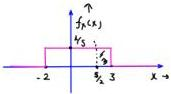

Q. x ~ u [-2, 3]

$$Y = 2x - 3$$

(i) find the PDF of \( Y \).
(ii) find \( E[Y] = ? \)
(iii) find \( P[Y > 2] = ? \)

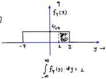

(ii) \( E[Y] = E[2x - 3] = 2E[x] - 3 = 2\left(\frac{3 - 2}{2}\right) - 3 = -2 \)
(ii) \( P[Y > 2] = P[2x - 3 > 2] = P[X > 5/2] = ? \)

$$= (3 - 5/2) \times 1/6 = \boxed{\frac{1}{10}}$$

$$Y = 2x - 3 \quad ; \quad x \sim U[-2, 3]$$

$$\begin{array}{l} Y_{min} = 2(-2) - 3 \\ = -7 \end{array} \quad \begin{array}{l} \Downarrow \\ Y \sim \text{Uniform} \end{array}$$

$$Y_{max} = 2(3) - 3 = 3$$

$$Y \sim U[-7, 3]$$

$$E[Y] = \frac{3 - 7}{2} = -2$$

$$P[Y > 2] = \frac{1}{10} \times 1 = 0.1$$

---
### Page 44

Q. $x \sim N(2, 4)$

$\mu_x = 2, \sigma_x^2 = 4; \sigma_x = 2$

another R.V. Y is defined. The relation b/w x and Y is given

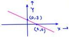

by the following graph

$f_x(x) = \frac{1}{\sqrt{8\pi}} e^{-(x-2)/8}$

(i) Find PDF of Y.

(ii) Find $P(-1 < Y < 8) = ?$

$\rightarrow Y = -x+3$

$P(-1 < Y < 8) = P(-1 < -x+3 < 3)$

$\rightarrow P(x > 0) = Q\left(\frac{a - \mu_x}{\sigma_x}\right)$

$= P(-4 < -x < 0)$

$= P(0 < x < 4) = P(x > 0) - P(x > 4) = Q\left(\frac{0-2}{2}\right) - Q\left(\frac{4-2}{2}\right) = Q(-1) - Q(1)$

$Y = -x+3$

$\mu_y = -\mu_x + 3$

$\boxed{\mu_y = -2+3=1}$

$\sigma_y^2 = (-1)^2 \sigma_x^2$

$\sigma_y < 2; \quad \boxed{\sigma_y^2 = 4}$

$x \sim \text{Gaussian}$

$Y \sim \text{Gaussian}$

$x \sim N(\mu_x, \sigma_x^2)$

$\mu_x = 2$

$\sigma_x^2 = 4$

$\boxed{Y \sim N(\mu_y, \sigma_y^2); \quad Y \sim N(1, 4)}$

$f_y(y) = \frac{1}{\sqrt{8\pi}} e^{-(y-2)/8}$

$P(-1 < Y < 3) = P(Y > -1) - P(Y > 3)$

$= Q\left(\frac{-1-1}{2}\right) - Q\left(\frac{3-1}{2}\right)$

$\boxed{P(-1 < Y < 3) = Q(-1) - Q(1)}$

Q

$y: \text{CRV}$

$f_x(x) = \begin{cases} x & ; \ 0 \le x < 1 \\ 2-x & ; \ 1 \le x \le 2 \\ 0 & ; \ 0/\omega \end{cases}$

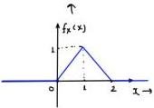

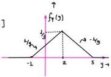

$\int_{\text{CRV}}^{Y = 3x-1}$

(a) Sketch $f_y(y)$ and define it.

(b) Find $E[Y] = ?$

$\rightarrow (b) \quad E[Y] = E[3x-1] = 3E[x] - 1$

$= 3\left[\frac{0+1+2}{3}\right] - 1 = \boxed{2 = E[Y]}$

$x \sim \Delta[0, 1, 2]$

$E[x] = \frac{0+1+2}{3} = 1$

$Y = 3x-1 \quad x \in [0, 2]$

$Y_{\min} = \delta(0) - 1 = -1$

$Y_{\max} = 3(2) - 1 = 5 \quad y \in [-1, 5]$

when $x = 1; \quad y = 3(1) - 1$

$= 2$

$Y \sim \Delta[-1, 2, 5]$

$\frac{1}{2} \times 6 \times k = 1$

$E[Y] = \frac{-1+2+5}{3}$

$\sqrt{E[Y] = 2}$

---
### Page 45

$$f_Y(y) = \begin{cases} \frac{y+1}{3} & ; -1 \le y < 2 \\ \frac{s-y}{3} & ; 2 \le y \le 5 \\ 0 & ; 0/\omega \end{cases}$$

Q. Let $x \in \{0, 1\}$ represent a Binary R.V. indicating the bit sent in a digital communication system.

$$P_x(0) = 0.7 \quad ; \quad P_x(1) = 0.3 \quad E[x] = 0(0.7) + 1(0.3) = 0.3$$

Let the modulator of signal be-

$$\text{DRV} \quad S = 2x - 1$$

$$N \sim N(0, 1)$$

(a) Find the PMF of S.

(b) If Received signal is $R = S + N$, where $N$ is zero mean, unit variance Gaussian noise. Find expected value of $R$.

$$\begin{array}{l} x \in \{0, 1\} \quad ; \quad P(X=0) = 0.7 \quad R = S + N \\ \quad \quad \quad \quad \quad \quad \quad \quad P(X=1) = 0.3 \quad E[R] = E[S] + E[N] \\ \quad \quad \quad \quad \quad \quad \quad \quad \quad \quad \quad \quad \quad \quad \quad \quad \quad \quad \quad \quad \quad \quad \quad \quad \quad \quad \quad \quad \quad \quad \quad \quad \quad \quad \quad \quad \quad \quad \quad \quad \quad \quad \quad \quad \quad \quad \quad \quad \quad \quad \text{E}[R] = -0.4 \end{array}$$

$$E[S] = E[2x - 1]$$

$$S = 2x - 1$$

$$= 2E[X] - 1$$

$$S = 2(0) - 1 = -1$$

$$= 2(0.3) - 1$$

$$S = 2(1) - 1 = 1$$

$$E[S] = -0.4$$

$$P(S=-1) = P(X=0) = 0.7$$

$$P(S=1) = P(X=1) = 0.3$$

$$x \in \{0, 1\}; E[x] = 0.3$$

$$S \in \{-1, 1\}$$

$$E(S) = -1(0.7) + 1(0.3)$$

$$E(1) = -0.4$$

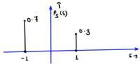

$$P_S(s) = 0.7 \delta[S+1] + 0.3 \delta[S-1]$$

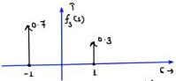

$$f_S(s) = 0.7 \delta(s+1) + 0.3 \delta(s-1)$$

* DRV to DRV Transformation:-

Q. $C_{X \in \{-2, -1, 0, 1, 2\}}$

$$P_X(x) = 1/S \quad ; \quad \text{for each } x$$

R.V. Y is defined as, $Y = x^2$

(a) Find the PMF of Y.

L(b) Find variance of Y.

$$Y = x^2$$

$$\sigma_Y^2 = ?$$

$$Y = ax + b$$

$$\sigma_Y^2 = a^2 \sigma_X^2$$

$$Z = ax + bY$$

$$\sigma_Z^2 = a^2 \sigma_Y^2 + b^2 \sigma_Y^2 + 2ab \sigma_Y$$

$$P(X=-2) = P(X=-1) = P(X=0) = P(X=1) = P(X=2) = 1/S$$

$$Y = x^2$$

$$x=-2; \quad Y=4 \quad x=-1; \quad Y=1 \quad ; \quad x=0; \quad Y=0$$

$$x=2; \quad Y=4 \quad x=1; \quad Y=1$$

---
### Page 46

$$\begin{array}{l} \text{ORV} \quad \gamma \in \{0, 1, 4\} \\ P[Y=0] = P[X=0] = 1/5 \\ P[Y=1] = P[X=-1] + P[X=1] = 2/5 \\ P[Y=4] = P[X=-2] + P[X=2] = 2/5 \\ f_Y(y) = \frac{1}{5}\delta(y) + \frac{2}{5}\delta(y-1) + \frac{2}{5}\delta(y-4) \\ \sigma_Y^2 = E[Y^2] - \{E[Y]\}^2 \quad ; \quad E[Y^2] = (0)^2 1/5 + (1)^2(2/5) + (4)^2(3/5) = 2/5 + \frac{32}{5} \\ = \frac{94}{5} - 4 \\ \sigma_Y^2 = \frac{14}{5} \quad E[Y] = 0(1/5) + 1(2/5) + 4(3/5) = \frac{10}{5} = 2 \end{array}$$

Q. Let $x, z \in \{0, 1\}$ be independent ORVs with:-

$$P_x(0) = 0.6 \quad ; \quad P_x(1) = 0.4$$

$$P_z(0) = 0.7 \quad ; \quad P_z(1) = 0.3$$

$$\text{or } x \in \mathbb{R}$$

$$Y = x \oplus z$$

(a) Find PMF of $Y$.

(b) Find $E[Y]$

$$y \in \{0, 1\}$$

$$z \in \{0, 1\}$$

$$Y = x \oplus z$$

$$= 0 \oplus 0 = 0 \checkmark$$

$$= 0 \oplus 1 = 1$$

$$= 1 \oplus 0 = 1$$

$$= 1 \oplus 1 = 0$$

$$Y = x \oplus z$$

$$E[Y] = \boxed{E[y \oplus z]} \quad x \times$$

$$= E[y] \oplus E[z] \quad x$$

$$Y \in \{0, 1\}$$

$$P[Y=0] = P[X=0, z=0] + P[X=1, z=1]$$

$$= P[X=0] \cdot P[Z=0] + P[Y=1] \cdot P[Z=1]$$

$$= 0.6 \times 0.7 + 0.4 \times 0.3$$

$$P[Y=0] = 0.42 + 0.12 = 0.54$$

$$\begin{array}{l} P[Y=0] = 0.54 \quad Y \in \{0, 1\} \\ P[Y=1] = 0.46 \quad P[Y=1] = P[X=0] \cdot P[Z=1] + P[X=1] \cdot P[Z=0] \\ = 0.6 \times 0.3 + 0.7 \times 0.4 \\ = 0.18 + 0.28 = 0.46 \\ E[Y] = (0)(0.54) + (1)(0.46) \\ E[Y] = 0.46 \quad \text{and} \\ \end{array}$$

Q. Let $x \in \{1, 2, 3, 4\}$ with $P(x=1) = 3/8$ ; $P(x=2) = 1/4$

$$Y = \begin{cases} x & ; \text{ even} \\ 5 - x & ; \text{ odd} \end{cases}$$

$$P(X=3) = 1/8$$

$$P(X=4) = 1/4$$

Find $F_Y(4) - F_Y(2)$

$$P[Y \le 4] - P[Y \le 2] = P[2 < Y \le 4]$$

$$x \in \{1, 2, 3, 4\}$$

$$\downarrow \quad \downarrow \\ \text{odd} \quad \text{odd}$$

$$x = 1 \rightarrow \text{odd} \quad Y = 5 - 1 = 4$$

$$\rightarrow y = 2 \rightarrow \text{Even} \quad Y = 2$$

$$Y \in \{4, 2, 2, 4\}$$

$$\rightarrow x = 3 \rightarrow \text{odd} \quad Y = 5 - 3 = 2$$

$$x = 4 \rightarrow \text{Even} \quad Y = 4$$

---
### Page 47

$$y \in \{1, 4\}$$

$$P[Y=2] = P[x=2] + P[x=3] = 1/8 + \frac{1}{4} = 3/8$$

$$P[Y=4] = 5/8$$

$$P[Y=4] = P[x=4] + P[x=1]$$

$$= 3/8 + 1/4 = 5/8$$

$$F_Y(4) = P[Y \le 4]$$

$$= P[Y=2] + P[Y=4] = 1$$

$$F_Y(2) = P[Y \le 2]$$

$$= P[Y=2] = 3/8$$

$$F_Y(4) - F_Y(2) = 1 - 3/8 = \boxed{5/8} \text{ plus}$$

Q. Let $x_1, x_2 \in \{1, 2, 3\}$ be identical and independent (i.i.d. R.V.)

Random variable with

$$P(X) = \begin{cases} 0.2 & ; x=1 \\ 0.5 & ; x=2 \\ 0.3 & ; x=3 \end{cases}$$

$$P(x_1=1) = P(x_2=1) = 0.2$$

$$P(x_1=2) = P(x_2=2) = 0.5$$

$$P(x_1=3) = P(x_2=3) = 0.3$$

$$\text{RV } M = \max(x_1, x_2)$$

$$\text{RV } M = \min(x_1, x_2)$$

$$(5) P\left(\frac{M=3}{M=3}\right) = \frac{P[M=3 \cap M=3]}{P(M=3)}$$

(a) PMF of M and M

$$= P\left[\frac{x_1=3, x_2=3}{0.09}\right]$$

(b) Are M and M independent? $\rightarrow$ NO

$$= \frac{0.3 \times 0.3}{0.09} = 1$$

(c) $P(M=3/M=3) = ? = 1 \neq P(M=3)$

4. $M \in \{1, 2, 3\}$ $x_1$ and $x_2$ independent

$$P(M=1) = P(x_1=1, x_2=1) = P(x_1=1) \cdot P(x_2=1) = (0.2)^2 = 0.04$$

$$P(M=2) = P(x_1=1, x_2=2) + P(x_1=2, x_2=2) + P(x_1=2, x_2=1)$$

$$= (0.2 \times 0.5) + (0.5 \times 0.5) + (0.5 \times 0.2)$$

$$= 0.1 + 0.25 + 0.1 = 0.45$$

$$P(M=3) = 1 - 0.04 - 0.45 = 0.51$$

4. $M \in \{1, 2, 3\}$

$$P(M=3) = P(x_1=3, x_2=3) = 0.3 \times 0.3 = 0.09$$

$$P(M=2) = P(x_1=3, x_2=1) + P(x_1=2, x_2=3) + P(x_1=2, x_2=2)$$

$$= 0.3 \times 0.5 + 0.5 \times 0.3 + 0.5 \times 0.5 = 0.55$$

$$P(M=1) = 1 - 0.09 - 0.55 = 0.36$$

$$M \in \{1, 2, 3\}$$

$$P[M=\infty] \in \{0.04, 0.45, 0.51\}$$

$$M \in \{1, 2, 3\}$$

$$P[M=\infty] = \{0.36, 0.55, 0.09\}$$

|  4 | $x_1$ | $x_2$ | $M = \max(x_1, x_2)$ | $M = \min(x_1, x_2)$  |
| --- | --- | --- | --- | --- |
|   | 1 | 1 | 1 $\lor$ | 1  |
|   | 1 | 2 | 2 $\lor$ | 1  |
|   | 1 | 3 | 3 | 1  |
|   | 2 | 1 | 2 $\lor$ | 1  |
|   | 2 | 2 | 2 $\lor$ | 2  |
|   | 2 | 3 | 3 | 2  |
|   | 3 | 1 | 3 | 1  |
|   | 3 | 2 | 3 | 2  |
|   | 3 | 3 | 3 $\rightarrow$ $\lor$ | 3 $\rightarrow$ $\lor$  |

$$x_1, x_2 \in \{1, 2, 3\}$$

---
### Page 48

4 CRV to DRV Transformation:-

$$\nu_{DRV} \rightarrow DRV$$

$$\nu_{DRV} \rightarrow CRV$$

$$\nu_{CRV} \rightarrow DRV$$

Q: $$x \sim U[0, 5]$$

Another R.V. Y is defined.

Relation b/w R.V. X and Y is given by:-

$$\underbrace{CRV \rightarrow CRV}_{\Downarrow}$$

$$Y = ax + b \vee$$

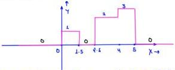

(i) Find the expression of $$f_Y(y)$$

(ii) Find $$E[Y] = ? = 1.5$$

4 $$\underset{D.R.V.}{\rightarrow} Y \in \{0, 1, 2, 3\}$$ $$E[Y] = 0 + 0.3 + 0.6 + 0.6 = \boxed{1.5}$$

$$P[Y=0] = P[1.5 < x < 2.5] + P[x \neq 0.5] + P[x \neq 0]$$

$$= 1 \times 1/3 +$$

$$P[Y=0] = 0.2$$

$$P[Y=1] = P[0 < x < 1.5] = 1/5 \times 1.5 = 0.3$$

$$P[Y=2] = P[2.5 < x < 4] = 1/5 \times 1.5 = 0.3$$

$$P[Y=3] = P[4 < x < 5] = 1/5 \times 1 = 0.2$$

$$Y \in \{0, 1, 2, 3\} \quad P[Y=y_i] = \{0.2, 0.3, 0.3, 0.2\}_{i=0}^3$$

$$f_Y(y) = 0.2\delta(y) + 0.3\delta(y-1) + 0.3\delta(y-2) + 0.2\delta(y-3)$$

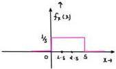

A uniformly distributed random variable X with probability density function

$$f_X(x) = \frac{1}{10}(u(x+5) - u(x-5))$$

where $$u(\cdot)$$ is the unit step function, is passed through a transformation given in the figure below.

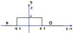

The probability density function of the transformed random variable Y would be:

Options:

(A) $$f_Y(y) = \frac{1}{5}(u(y+2.5) - u(y-2.5))$$

(B) $$f_Y(y) = 0.5\delta(y) + 0.5\delta(y-1)$$

(C) $$f_Y(y) = 0.25\delta(y+2.5) + 0.25\delta(y-2.5) + 0.5\delta(y)$$

(D) $$f_Y(y) = 0.25\delta(y+2.5) + 0.25\delta(y-2.5) + \frac{1}{10}(u(y+2.5) - u(y-2.5))$$

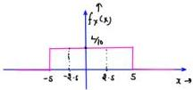

$$Y \in \{0, 1\}$$

$$P[Y=0] = P[x > 2.5] + P[x < -2.5] = \frac{2.5}{10} + \frac{2.5}{10} = 1/2 = 0.5$$

$$P[Y=1] = P[-2.5 < x < 2.5] = 5 \times 1/10 = 0.5$$

$$f_Y(y) = 0.5\delta(y) + 0.5\delta(y-1)$$

---
### Page 49

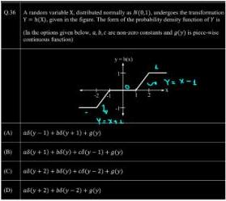

$$f_{Y}(y) = ?$$

$$x \sim N(0, L)$$

$$\mu_{Y} = 0$$

$$\sigma_{Y}^{2} = 1$$

$$\downarrow Y \in \{-1, 0, L\} + (0, L) + (-1, 0)$$

$$\text{Mixed } \\ \text{RV}$$

$$Y = \begin{cases} 0 & ; -1 < x < 1 \\ 1 & ; x > 2 \\ -1 & ; x < -2 \\ x-1 & ; 1 < x < 2 \\ x+1 & ; -2 < x < -1 \end{cases}$$

$$P[Y=0] = P[-1 < x < L] = P[Y > -L] - P[X > L]$$

$$= Q\left(\frac{-1}{L}\right) - Q\left(\frac{1}{L}\right) = Q(-1) - Q(1) = \text{constant} = b$$
$$P[Y=L] = P[X>2] = Q\left(\frac{2-0}{L}\right) = Q(2) = \text{constant} = c$$

$$P(Y=-L) = P(X<-2) = 1 - P(X>-2)$$

$$= 1 - Q\left(-\frac{2}{L}\right) = Q(1) = \text{constant} = a$$

$$1 < x < 2 \quad \text{Gaussian}$$
$$\downarrow Y = x - L$$
$$\text{Gaussian}$$

$$E[Y] = E[Y] - L$$
$$= 0 - 1 = -L$$
$$\sigma_{Y}^{2} = \sigma_{X}^{2} = 1$$

$$f_{Y}(y) = \frac{1}{\sqrt{2\pi}} e^{-(y+1)/2}; \quad 0 < y < L$$

$$-2 < y < -1 \quad \text{Gaussian}$$
$$\downarrow Y = x + L$$
$$\text{Gaussian}$$

$$E[Y] = 1; \quad f_{Y}(y) = \frac{1}{\sqrt{2\pi}} e^{-(y-1)/2}; \quad -1 < y < 0$$
$$\sigma_{Y}^{2} = 1$$

$$\text{POF} \quad f_{Y}(y) = \begin{cases} b\delta(y) & ; y=0 \\ a\delta(y+1) & ; y=-1 \\ c\delta(y-1) & ; y=1 \\ p(y) & ; -1 < y < 0 \\ Q(y) & ; 0 < y < 1 \end{cases}$$

$$f_{Y}(y) = a\delta(y+1) + b\delta(y) + c\delta(y-1) + g(y)$$

---
### Page 50

N.B. We will see more examples of CRV to CRV Non-linear Transformation, but those are not much important. We can see those examples after the next lecture.

For x, y, z are 3 i.i.o. R.V.

Find the probability such that R.V. x is largest.

4

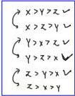

4

$$\begin{array}{l} P(Z \text{ is smallest}) = 1/3 \\ P(X \text{ is smallest}) = 2/6 = 1/3 \\ P(Y \text{ is smallest}) = 1/3 \end{array}$$

$$x \sim U[0, L]$$

$$Y \sim U[0, L]$$

$$Z \sim U[0, L]$$

$$P(X \text{ is largest}) = \frac{2}{6} = \frac{1}{3}$$

$$P(Y \text{ is largest}) = \frac{2}{6} = 1/3$$

$$P(Z \text{ is largest}) = 2/6 = 1/3$$

4 $$x_1, x_2, x_3 \dots x_n$$ are n i.i.o. R.V.

$$P(x_1 \text{ is largest}) = 1/n$$

$$P(x_2 \text{ is largest}) = 1/n$$

$$P(x_n \text{ is largest}) = 1/n$$

$$P(x_1 \text{ is smallest}) = 1/n$$

$$P(x_2 \text{ is smallest}) = 1/n$$

$$P(x_n \text{ is smallest}) = 1/n$$

$$P(X_1 > X_2 > X_3 \dots X_n) = \frac{1}{n!}$$

$$\overline{x}_n \quad \overline{y}_{n-1} \quad \overline{y}_{n-2} \quad \overline{y}_{n-3}$$

Q. 4 R.V. x, y, z, w are i.i.d. R.V.

$$(a) P(X \text{ is largest}) = 1/4 = \frac{6}{24}$$

$$(b) P(X > Y > Z > W) = 1/4! = \frac{1}{24}$$

$$\begin{array}{c c c c c} \hline 3 & 3 & 3 & 3 & = 4! \\ 4 & 3 & 2 & 1 & \end{array}$$

$$4x > y > z > w \quad x > z > w > Y$$

$$x > y > w > z \quad x > w > z > Y$$

$$x > z > y > w \quad x > w > y > z$$

* Some miscellaneous Questions:-

Q. Given that $$\max (x, y) > z$$; which of the following statement is true?

$$(a) x > z, y < z \quad (b) x < z, y > z$$

$$(c) x > z, y > z \quad (d) all$$

Q. Given that $$\max (x, y) < z$$; which of the following statement is true?

$$(a) x < z, y < z \quad (b) x > z, y < z$$

$$(c) x < z, y > z \quad (d) x > z, y > z$$

---
### Page 51

Q. x and Y are two independent CRV.

$$P(x > t_{1/2}) = 0.3, \quad P(Y > t_{1/2}) = 0.4$$

$$\text{Find } P[\max(x, Y) > t_{1/2}]$$

$$P(x < t_{1/2}) = 0.7$$

$$P(Y < t_{1/2}) = 0.6$$

$$P[\max(x, Y) > t_{1/2}] = P[x > t_{1/2}, Y > t_{1/2}] + P[x < t_{1/2}, Y > t_{1/2}]$$

$$+ P[x > t_{1/2}, Y < t_{1/2}]$$

$$= 0.8 \times 0.4 + 0.7 \times 0.4 + 0.3 \times 0.6$$

$$= 0.12 + 0.28 + 0.18 = \boxed{0.58}$$

$$P[\max(x, Y) > t_{1/2}] = L - P[\max(x, Y) < t_{1/2}]$$

$$= L - P[x < t_{1/2}, Y < t_{1/2}]$$

$$= 1 - 0.7 \times 0.6 = L - 0.42 = 0.58$$

Q. Given that $\min(x, y) > z$; which of the following statement is true?

$$(a) x > z, y < z$$

$$(b) x < z, y > z$$

$$(c) x > z, y > z$$

$$(d) x < z, y < z$$

Q. Given that $\min(x, y) < z$; which of the following statement is true?

$$(a) x < z, y < z$$

$$(b) x > z, y < z$$

$$(c) x < z, y > z$$

$$(d) \text{ all}$$

Q. x and Y are two independent CRV.

$$P(x > t_{1/2}) = 0.3, \quad P(Y > t_{1/2}) = 0.4$$

$$\text{Find } P[\min(x, Y) < t_{1/2}]$$

$$P[\min(x, Y) < t_{1/2}] = P[x < t_{1/2}, Y < t_{1/2}] + P[x < t_{1/2}, Y > t_{1/2}]$$

$$+ P[x > t_{1/2}, Y < t_{1/2}]$$

$$= 0.7 \times 0.6 + 0.7 \times 0.4 + 0.3 \times 0.6$$

$$= 0.42 + 0.28 + 0.18 = 0.88$$

$$P[\min(x, Y) < t_{1/2}] = L - P[\min(x, Y) > t_{1/2}] = L - P[x > t_{1/2}, Y > t_{1/2}]$$

$$= L - 0.3 \times 0.4$$

$$= L - 0.12 = 0.88$$

---
### Page 52

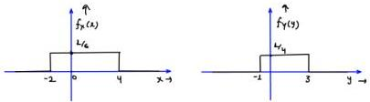

Q. x ~ u[-2, 4] ; y ~ u[-1, 3]

x & y are independent R.V.

e.v. M = max(x, y)

e.v. m = min(x, y)

Find the probabilities.

(a) p(m < 0)

(b) p(M > 0)

(c) p(-1 < m < 2)

(d) p(-1 < M < 2)

(e) p(-1 < m < 0 < M < 2)

Answers.

(a) 1/2 (b) 1 1/12 (c) 3/4

(d) 1/2 (e) 1/6

(a) p(m < 0) = p[min(x, y) < 0] = 1 - p[min(x, y) > 0]

= 1 - p[x > 0, y > 0] = 1 - p[x > 0] · p[y > 0]

= 1 - 2/3 x 3/4 = 1/2

(b) p(M > 0) = p[max(x, y) > 0] = 1 - p[max(x, y) < 0]

= 1 - p[x < 0, y < 0] = 1 - p[x < 0] · p[y < 0]

= 1 - 1/3 x 1/4 = 1 1/12

(s) p(-1 < m < 2) = p(m < 2) - p(m < -1) →

= p(m > -1) - p(m > 2)

= p[min(x, y) > -1] - p[min(x, y) > 2]

= p[x > -1, y > -1] - p[y > 2, y > 2]

= 5/6 x 1 - 1/3 x 1/4 = 5/6 - 1/12 = 3/12 = 3/4

(d) p(-1 < M < 2) = p(M < 2) - p(M < -1)

= p[max(x, y) < 2] - p[max(x, y) < -1]

= p[x < 2, y < 2] - p[x < -1, y < -1]

= 2/3 x 3/4 - 1/6 x 0 = 1/2

(e) p(-1 < m < 0 < M < 2) = p(-1 < m < 0, 0 < M < 2)

= p(-1 < m < 0) · p(0 < M < 2) X X

M and M depends on each other

= p[-1 < min(x, y) < 0, 0 < max(x, y) < 2]

= p[-1 < x < 0, 0 < y < 2] + p[0 < x < 2, -1 < y < 0]

= 1/6 x 1/2 + 1/3 x 1/4 = 1/12 + 1/12 = 1/6 ANS

---
### Page 53

* Some Important Points:

(i) Addition of Independent R.V. $\rightarrow$ Uniform Gaussian
net $x_1 \sim u[0, 1]$ Anything else

$x_2 \sim u[1, 2]$

$x_3 \sim u[-2, 3]$

$x = x_1 + x_2 + x_3 + \dots \dots \dots x_n$

$f_x(x) = f_{x_1}(x) * f_{x_2}(x) * f_{x_3}(x) * \dots \dots * f_{x_n}(x)$

Q.

$x \sim u[-2, 2]$

$y \sim u[-3, 3]$

$p[x + 2y - 3 < 2]$

$p[x + 2y < 5]$

$x$ and $y$ are independent R.V. $p[-2 < x + y < 2]$

Find $p[x + y \le 2]$, $p[x + 2y - 3 < 2]$, $p[|x + y| \le 2]$

4

$f_x(x) = \begin{cases} \frac{1}{4}; & -2 < x < 2 \\ 0; & 0/\infty \end{cases}$ $f_y(y) = \begin{cases} \frac{1}{6}; & -3 < y < 3 \\ 0; & 0/\infty \end{cases}$

$f_{xy}(x,y) = f_y(x) f_y(y) = \begin{cases} \frac{1}{24}; & -2 < x < 2, -3 < y < 3 \\ 0; & 0/\infty \end{cases}$

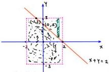

$$\begin{aligned} \text{(i)} \quad p(x+y \le x) &= \int_{x=-1}^{2} \int_{y=-3}^{2-x} f_{xy}(x,y) \, dx \cdot dy + \int_{x=-2}^{-1} \int_{y=-3}^{3} f_{xy}(x,y) \, dx \, dy \\ &= 1 - \int_{x=-1}^{2} \int_{y=-3}^{3} f_{xy}(x,y) \, dx \, dy \end{aligned}$$

$$\begin{aligned} &= 1 - \int_{x=-1}^{2} \int_{y=1-x}^{3} \frac{1}{24} \, dx \, dy \\ &= 1 - \frac{1}{24} \int_{x=-1}^{2} 1+x \cdot dx = 1 - \frac{1}{24} \left[ x + \frac{x^2}{2} \right]_{-1}^{2} \\ &= 1 - \frac{1}{24} \left[ 2 + 2 - (-1 + 1/2) \right] \\ &= 1 - \frac{4 \cdot 5}{24} = \boxed{0.8125} \end{aligned}$$

---
### Page 54

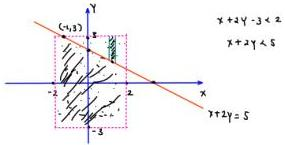

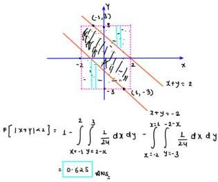

$$P(x+2y-3<2) = P(x+2y<5) = 1 - \int_{x=-1}^{2} \int_{y=-\frac{5-x}{2}}^{3} \frac{1}{24} \cdot dx \cdot dy$$
$$= 0.90625$$

$$x \sim U[-2, 2]$$

$$z = x + y$$

$$z_{min} = -1 \cdot 3 = -5$$

$$y \sim U[-3, 3]$$

$$z_{max} = 2+3 = 5$$

$$(9) \quad P[x+y \le 2] = P[z \le 2] = \int_{-\infty}^{2} f_x(z) \cdot dz$$
$$z = x + y$$

$$f_x(z) = f_y(z) * f_y(z)$$

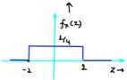

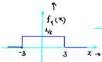

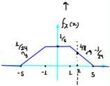

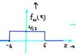

$$P(z \le 2) = 1 - \frac{1}{2} \times 3 \times \frac{1}{8} = 1 - \frac{3}{16} = 0.8125$$

$$(3) \quad P[x+2y-3<2] = P[x+2y<5] = P(z<5) = \int_{-\infty}^{5} f_z(z) \cdot dz$$

$$z = x + 2y$$

$$z = x + w$$

$$f_x(z) = f_y(z) * f_w(z)$$

$$\sim x \sim U[-1, 2]$$

$$y \sim U[-3, 3]$$

$$P(z<5) = 1 - \frac{1}{2} \times 3 \times \frac{3}{48} = 1 - \frac{9}{96} = 0.90625$$

$$\sim w \sim U[-6, 6]$$

$$w = 2y$$

---
### Page 55

(5) $$p[|x+y|<2] = p[-2<x+y<2] = p(-2<z<2) = \int_{-1}^{2} f_z(z) \, dz$$

$$z = x + y$$

$$f_z(z) = f_x(z) * f_y(z)$$

$$p[|z|<2] = 1 - \frac{2 \times 3}{16} = \boxed{0.625} \text{ Ans.}$$

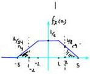

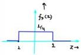

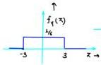

4(ii) addition / subtraction of GRV will always be Gaussian only.

Q. $$x \sim N(2, 4)$$ ; $$y \sim N(3, 2)$$

x and y are independent.

Find $$p(x > \frac{3y}{2}) = ?$$

$$p(x > \frac{3y}{2}) = p(2x - 3y > 0) = p(z > 0) = Q\left(0 - \frac{\mu_z}{\sigma_z}\right)$$

$$f_z = 2x - 3y$$

$$\mu_z = 2\mu_x - 3\mu_y$$

$$= 2(1) - 3(3) = 2 - 9 = -7$$

$$\mu_x = -7$$

$$z = 2x - 3y$$

$$\sigma_z^2 = 4\sigma_x^2 + 9\sigma_y^2 - 12\sigma_z^2$$

$$\sigma_z^2 = 4\sigma_x^2 + 9\sigma_y^2$$

$$= 4(4) + 9(2)$$

$$\sigma_z^2 = 25$$

$$\sigma_z = 5$$

$$p(x > \frac{3y}{2}) = Q\left(\frac{7}{5}\right)$$

Ans.

$$z = ax + by$$

$$\sigma_z^2 = a^2\sigma_x^2 + b^2\sigma_y^2$$

$$+ 2ab\sigma_{xy}$$

$$cov(x, y)$$

x and y are independent

$$E[x \, y] = E[x] - E[y]$$

$$\sigma_{xy} = E[x \, y] - E[x] - E[y]$$

$$\sigma_{xy} = 0$$

Q. $$x \sim N(0, 4)$$ ; $$y \sim N(0, 9)$$

$$\sigma_{xy} = 3$$

$$p(|x-y| > 2)$$

4 x and y are not independent

$$p(|z|>2) = p(z>2) + p(z<-2) = p(z>2) + 1 - p(z>-2)$$

$$z = x - y$$

$$\mu_z + \mu_y - \mu_y = 0 - 0 = 0$$

$$\sigma_z^2 = \sigma_x^2 + \sigma_y^2 - 2\sigma_{xy} = 4 + 9 - 2(3) = 7$$

$$\boxed{\sigma_z = \sqrt{7}, \mu_z = 0}$$

$$= 1 + Q\left(\frac{2 - \mu_z}{\sigma_z}\right) - Q\left(\frac{-2 - \mu_z}{\sigma_z}\right)$$

$$= 1 + Q\left(\frac{2}{\sqrt{7}}\right) - Q\left(\frac{-2}{\sqrt{7}}\right)$$

$$= 2Q\left(\frac{2}{\sqrt{7}}\right)$$

---
### Page 56

Q. $x \sim N(1, 4)$ ; $y \sim N(2, 9)$ ; $z \sim N(3, 4)$

$x, y, z$ are independent

$P\left(x - \frac{2y}{3}, z + 2\right) = ?$

$P(3x - 2y > 3z + 6) = P(3x - 2y + 3z > 6)$

$= P(w > 6) = Q\left(\frac{6 - \mu_w}{\sigma_w}\right) = Q\left(\frac{6 - 8}{\sqrt{108}}\right)$

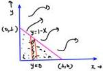

$w = 3x - 2y + 3z$

$\mu_w = 3(1) - 2(2) + 3(5)$

$= 3 - 4 + 9 = 8$

$\sigma_w^2 = 9\sigma_x^2 + 4\sigma_y^2 + 9\sigma_z^2 = 36 + 36 + 36 = 108$ ; $\sigma_w = \sqrt{108}$

Q. $x$ and $y$ are two independent R.V.

$f_x(x) = 2e^{-2x} u(x)$ ; $f_y(y) = 3e^{-3y} u(y)$

another R.V. $z$ is defined as $z = x + y$

(a) $P(z > 1) \rightarrow [\text{deg}: 0.5]$ (b) PDF of $z = ?$

$P(z > 1) = P(x + y > 1)$

$f_{xy}(x, y) = f_y(z)$ $f_y(y) = 6e^{-2x} e^{-3y} \underbrace{u(x)}_{0 < x < \infty} \underbrace{u(y)}_{0 < y < \infty}$

$P(x + y > 1) = 1 - \int_{x=0}^{1} \int_{y=0}^{1-x} 6e^{-2x} e^{-3y} dx dy$

$= 1 - \frac{6}{3} \int_{x=0}^{1} e^{-2x} \left[e^{-3y}\right]_{1-x}^0$

$= 1 - \frac{6}{3} \int_{x=0}^{1} e^{-2x} \left[e^{-3y}\right]_{1-x}^0$

$= 1 - 2 \int_{x=0}^{1} e^{-2x} \left[ 1 - e^{3x} e^{-3} \right] dx$

$= 1 - 2 \int_{0}^{1} e^{-2x} dx + 2 \int_{0}^{1} e^{-3} e^x dx$

$= 1 - \frac{2}{2} \left[ e^{-2x} \right]_1^0 + 2e^{-3} \left[ e^x \right]_0^1$

$= 1 - \left[ 1 - e^{-2} \right] + 2e^{-3} \left[ e^1 \cdot 1 \right] = +e^{-2} + 2e^{-2} - 2e^{-3}$

$= 3e^{-2} - 2e^{-3} = \boxed{0.8}$

$\underline{\underline{M-F}}$
$z = x + y$

$f_x(z) = f_x(x) * f_y(x)$

$f_x(x) = 2e^{-2x} u(x)$ $f_y(x) = 3e^{-3x} u(x)$

$f_x(x) = 6e^{-2x} u(x) * e^{-3x} u(x)$

$= 6 \left[ \frac{1}{s+2} \cdot \frac{1}{s+3} \right]$

$= c \left[ \frac{1}{s+2} - \frac{1}{s+3} \right] = 6 \left[ e^{-2x} - e^{-3x} \right] u(x)$

$f_x(x) = 6 \left[ e^{-2x} - e^{-3x} \right] u(x)$

$P(z > 1) = 6 \int_{1}^{\infty} \left[ e^{-2x} - e^{-3x} \right] dx = 6 \left[ \frac{e^{-2x}}{2} - \frac{e^{-3x}}{3} \right]_\infty^1$

$= 6 \left[ \frac{e^{-2}}{2} - \frac{e^{-3}}{3} \right] = 3e^{-2} - 2e^{-3} = \boxed{0.3}$

---
### Page 57

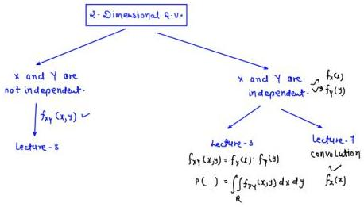

# * Central limit theorem:-

If you take a large number of independent and identically distributed (i.i.d.) random variables, their average (or sum) will be approximately normally distributed, no matter what the original distribution was — as long as the variables have a finite mean and variance.

Q. u, v, w, x, y are 5 I.I.O. R.V. ~ u[0,1]

$$R.V. Z = U + 2V - W + x - 2Y$$

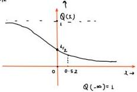

$$P(Z > 1) = ?$$

(a) 0.5 (b) 0.3 (c) 0.8 (d) 1

$$f_Z(x) \to Gaussian$$

$$Z \sim N(\mu_z, \sigma_z^2)$$

$$P(U + 2V - W + x - 2Y > 1) = ?$$

$$P(Z > 1) = Q\left(\frac{1 - \mu_z}{\sigma_z}\right)$$

$$Z = U + 2V - W + x - 2Y$$

$$\mu_z = \frac{1}{2} + 2(\frac{1}{2}) - \frac{1}{2} + \frac{1}{2} - 2(\frac{1}{2}) = \frac{1}{2}$$

$$\sigma_z = \sqrt{\frac{1}{2}}$$

$$\sigma_z^2 = \sigma_u^2 + 4\sigma_v^2 + \sigma_w^2 + \sigma_x^2 + 4\sigma_y^2 = \frac{1}{12} + \frac{4}{12} + \frac{1}{12} + \frac{1}{12} + \frac{4}{12} = \frac{1}{12}$$

$$P(Z > 1) = Q\left(\frac{1 - 0.5}{\sqrt{\frac{1}{12}}}\right) = Q(0.52) = ? = 0.3$$

$$Q(0) = 1/2$$

$$Q(0.52) < 1/2$$

$$Q(0.52) < 0.5$$

---
### Page 58

4 Summary:-

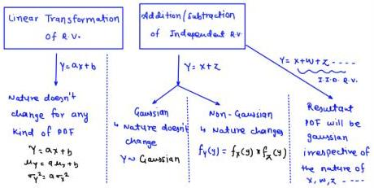

4 $$Y = ax + b$$

$$\mu_Y = a\mu_y + b$$

$$\sigma_Y^2 = a^2\sigma_x^2$$

$$Y = x + z$$

$$\mu_Y = \mu_y + \mu_z$$

$$\sigma_Y^2 = \sigma_x^2 + \sigma_z^2 + 2\sigma_{xz}^{cov(x,z)}$$

4 if x, z, w, u are independent R.V.

$$Y = x + z$$

$$\mu_Y = \mu_y + \mu_z$$

$$\sigma_Y^2 = \sigma_x^2 + \sigma_z^2$$

$$V = x + z + w + u$$

$$\mu_V = \mu_y + \mu_z + \mu_w + \mu_v$$

$$\sigma_V^2 = \sigma_x^2 + \sigma_z^2 + \sigma_w^2 + \sigma_v^2$$

4 CRV to CRV Non-Linear Transformation:-

Q

$$f_x(z) = 2e^{-2z}U(z)$$

$$Y = \ln(x+\lambda)$$

$$\text{POF of } Y?$$

4

$$x \in [0, \infty]$$

$$Y = \ln(x+\lambda)$$

$$Y_{min} = \ln(\lambda) = 0$$

$$Y_{max} = \ln(\infty) = \infty$$

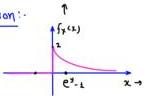

$$Y \in [0, \infty]$$

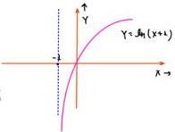

COF of Y

$$F_Y(y) = P[Y \le y] = P[\ln(x+\lambda) \le y]$$

$$= P[x \le e^{y-\lambda}]$$

$$= \int_{-\infty}^{e^{y-\lambda}} f_x(z) \, dz$$

$$F_Y(y) = 1 - e^{-2(e^{y-\lambda})}; 0 < y < \infty$$

$$f_Y(y) = \frac{d}{dy} F_Y(y)$$

$$= \int_{0}^{e^{y-\lambda}} a e^{-2x} \, dx = \frac{2}{\lambda} [e^{-2x}] e^{y-\lambda}$$

$$= -e^{-2(e^{y-\lambda})} \frac{d}{dy} [-2(e^{y-\lambda})]$$

$$f_Y(y) = ae^y e^{-2(e^{y-\lambda})U(y)}$$

$$= [1 - e^{-2(e^{y-\lambda})}]$$

---
### Page 59

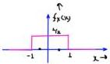

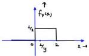

Q. $$x \sim \cup [0, 2]$$

$$\gamma = \frac{1}{x}$$

$$\text{PDF of } \gamma ?$$

$$x \in [0, 2]$$

$$y \in [\frac{1}{2}, \infty]$$

$$F_Y(y) = P[Y \le y] = P[\frac{1}{x} \le y] = P[x \ge \frac{1}{y}] = \int_{\frac{1}{y}}^2 f_X(x) \, dx = \frac{1}{2}[2 - \frac{1}{y}]$$

$$F_Y(y) = 1 - \frac{1}{2y} \quad ; \quad \frac{1}{2} < y < \infty$$

$$f_Y(y) = \frac{d}{dy} F_Y(y) = \frac{1}{2y^2} \quad ; \quad \frac{1}{2} < y < \infty$$

Q. $$x \sim \cup [-1, 1]$$

$$\gamma = x^2$$

$$\text{PDF of } \gamma = ?$$

$$y \in [0, 1]$$

$$F_Y(y) = P[Y \le y] = P[x^2 \le y] = P[-\sqrt{y} < x < \sqrt{y}] = \int_{\sqrt{y}}^{\sqrt{y}} f_X(x) \, dx = \frac{1}{2}[2\sqrt{y}] = \sqrt{y}$$
$$F_Y(y) = \sqrt{y} \quad ; \quad 0 < y < 1$$
$$f_Y(y) = \frac{d}{dy} F_Y(y) = \frac{1}{2\sqrt{y}} \quad ; \quad 0 < y < 1$$

Q. $$x \sim \cup [0, \pi]$$

$$\gamma = \cos x$$

$$\text{PDF of } \gamma ?$$

$$y \in [-1, 1]$$

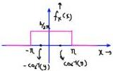

$$F_Y(y) = P[Y \le y] = P[\cos x \le y]$$

$$F_Y(y) = 1 - \frac{1}{\pi} \cos^{-1} y$$
$$-1 < y < 1$$

$$= P[x \ge \cos^{-1}(y)]$$

$$= \int_{\pi}^{x} f_X(x) \, dx = \frac{1}{\pi} [\pi - \cos^{-1} y]$$

$$f_Y(y) = \frac{1}{\pi \sqrt{1-y^2}} \quad ; \quad -1 < y < 1$$

$$= 1 - 1/\pi \cos^{-1} y \quad ; \quad -1 < y < 1$$

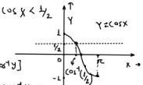

Q. $$x \sim \cup [-\pi, \pi]$$

$$\gamma = \cos x$$

$$\text{PDF of } \gamma = ?$$

$$y \in [-1, 1]$$

$$F_Y(y) = P[Y \le y] = P[\cos x \le y]$$

$$= P[x \ge \cos^{-1}(y)] + P[x \le -\cos^{-1}(y)]$$

$$= \frac{\pi - \cos^{-1} y}{2\pi} + \frac{\pi - \cos^{-1} y}{2\pi}$$

$$\boxed{\begin{array}{l} F_Y(y) = 1 - \frac{\cos^{-1}(y)}{\pi} \quad ; \quad -1 < y < 1 \\ f_Y(y) = \frac{1}{\pi \sqrt{1-y^2}} \quad ; \quad -1 < y < 1 \end{array}}$$

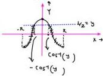

---
### Page 60

U and V are I.E.O. R.V. with zero mean.

COF of U and 2V are F(x) and G(x) respectively.

Correct statement of all values of x,

F(x) - G(x) ≤ 0

F(x) - G(x) ≥ 0

(c) [F(x) - G(x)] · x ≤ 0

[F(x) - G(x)] · x > 0

4

U ~ Uniform [-1, 1]

V ~ Uniform [-1, 1]

W = 2V

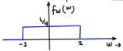

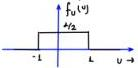

COF = ∫ P OF

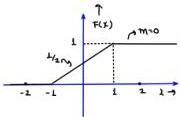

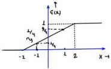

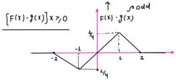

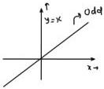

x₁ + x₂ + x₃ ∈ [0, 3]

Q. Let x₁, x₂, x₃ i.i.d. R.V. ~ U[0, 1]

GATE 2014

(a) P[x₁ + x₂ + x₃] = 1/6
(b) P[x₁ + x₂ + x₃ ≤ 1] = 1/6
(c) P[x₁ + x₂ + x₃ ≤ 2] = 5/6
(d) P[x₁ + x₂ + x₃ ≤ 3] = 1
(e) P[x₁ + x₂ + x₃ ≤ 0] = 0

μ = 1/2

σ² = 1/12

x = x₁

y = x₂

z = x₃ Q(0) = 1/2 ; Q(1) = 0.16

Q(∞) = 0 ; Q(1) = 0.84

Q(-∞) = 1

(a) P[x + y < z] = P[x + y - z < 0] = P[ω < 0] = 1 - P(ω > 0)

Gauasian

μ_w = μ_x + μ_y - μ_z = 1/2

σ_w² = σ_x² + σ_y² + σ_z² = 3x 1/12 = 1/4

= 1 - Q(0 - μ_z / σ_x) = 1 - Q(-1)

= Q(1)

σ_w = 1/2

= 0.16

4

f_x(x) = { 1 ; 0 < x < 1
0 ; 0/ω

f_y(y) = { 1 ; 0 < y < 1
0 ; 0/ω

x, y, z → independent

f_{xyz}(x, y, z) = f_y(x) · f_y(y) · f_z(x)

f_z(x) = { 1 ; 0 < z < 1
0 ; 0/ω

f_{yz}(x, y, z) = { 1 ; 0 < x < 1 , 0 < y < 1 , 0 < z < 1
0 ; 0/ω

---
### Page 61

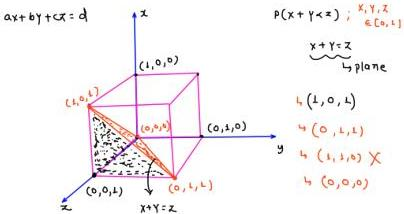

$$V = \frac{1}{3} (\text{drea of base}) \times \text{Height} = \frac{1}{3} \times [\frac{1}{2} \times 1 \times 1] \times 1 = \frac{1}{6}$$

$$\begin{aligned} P(x + y < z) &= \iiint_V f_{xyz}(x, y, z) \, dx \, dy \, dz \\ &= \iiint_V dx \, dy \, dz = \frac{1}{6} \end{aligned}$$

$$P(x + y < z) = \frac{1}{6} = 0.167$$

$$\therefore P(x + y + z \le 1)$$

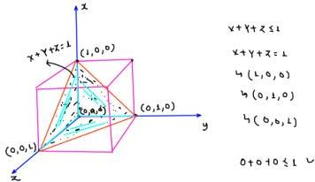

$$\begin{aligned} P(x + y + z < 1) &= \iiint_V f_{xyz}(x, y, z) \, dx \, dy \, dz = \iiint_V dx \, dy \, dz \\ &= \frac{1}{3} (\frac{1}{2}) (1) = \frac{1}{6} \end{aligned}$$

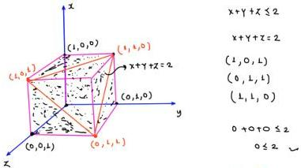

$$\iiint_V f_{xyz}(x, y, z) \, dx \, dy \, dz = 1 - \left( \frac{1}{3} \times \frac{1}{2} \times 1 \right) = \boxed{\frac{5}{6}} \text{ans}$$

---
### Page 62

N.B. - Poisson and binomial distribution will be studied before information theory / Engineering mathematics.